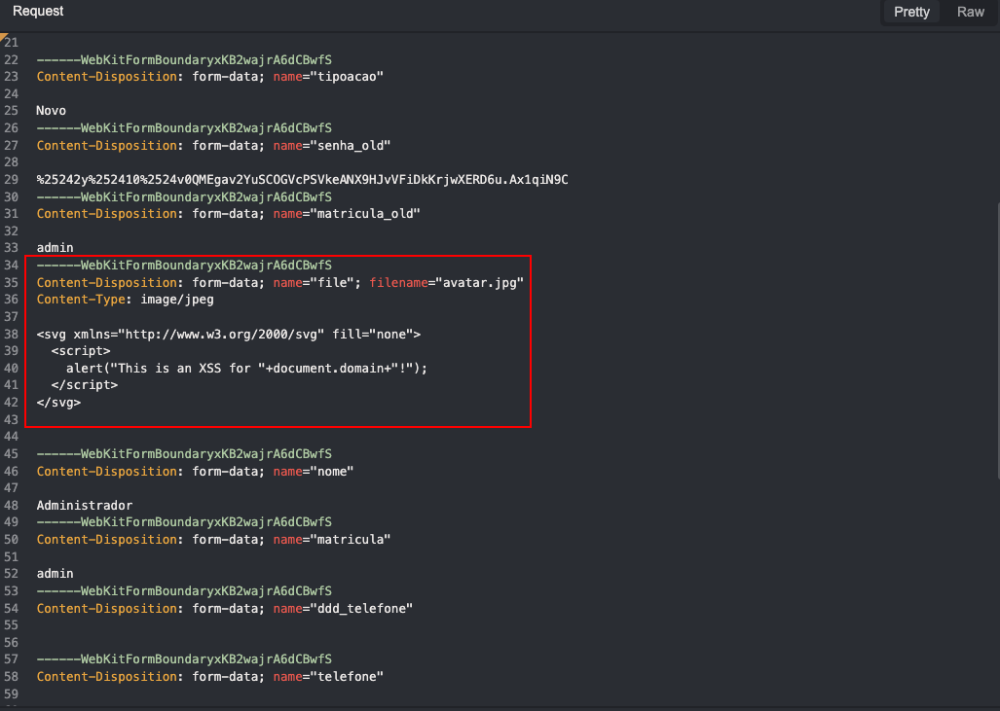
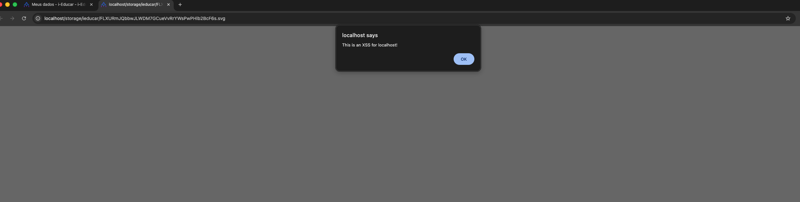

# Stored Cross-Site Scripting (XSS) via profile File Upload 
<div align="center">
  <a href="https://thoropass.com" target="_blank" rel="noopener noreferrer">
    
  </a>
  <br><br>
  <a href="https://thoropass.com" target="_blank" rel="noopener noreferrer">
    
  </a>
  <a href="https://linkedin.com/in/seu-perfil" target="_blank" rel="noopener noreferrer">
    
  </a>
  
  <h1>Thoropass Vulnerability Research Program</h1>
</div>
<table>
  <tr>
    <td><strong>Author</strong></td>
    <td><a href="https://www.linkedin.com/in/nmmorette/">Natan Morette</a> on behalf of <a href="https://thoropass.com">Thoropass</a></td>
  </tr>
  <tr>
    <td><strong>Affected Application</strong></td>
    <td>
      <a href="https://github.com/portabilis/i-educar">i-Educar</a><br>
      <small>
        Open-source, web-based school management system widely used by public
        education institutions in Brazil to manage academic and administrative
        data in real time.
      </small>
    </td>
  </tr>
  <tr>
    <td><strong>Affected Version</strong></td>
    <td>2.10.0</td>
  </tr>
  <tr>
    <td><strong>Endpoint</strong></td>
    <td><code>/intranet/meusdadod.php</code></td>
  </tr>
  <tr>
    <td><strong>Vulnerability Type</strong></td>
    <td>Stored Cross-Site Scripting</td>
  </tr>
    <tr>
    <td><strong>CVE ID</strong></td>
    <td>
      <a href="https://www.cve.org/CVERecord?id=CVE-2026-2064" target="_blank" rel="noopener noreferrer">
        
      </a>
    </td>
  </tr>
</table>


## **Summary**

The `/intranet/meusdadod.php` endpoint allows authenticated users to upload profile pictures (avatars) without proper file type validation or content sanitization. By exploiting the lack of server-side MIME type verification and file content inspection, an attacker can upload a malicious SVG file containing embedded JavaScript code disguised as a legitimate image file.

When any user accesses the uploaded file directly via its URL (e.g., when viewing a user profile or avatar), the browser interprets the SVG content and executes the embedded JavaScript in the victim's security context, resulting in **Stored Cross-Site Scripting (XSS)**.


## **Technical Details**

➤ Vulnerable Endpoint: `/intranet/meusdadod.php`

➤ Parameter: `file`

---

**PoC (Proof of Concept)**

**➤ Step by Step:**

1. Navigate to the user data page: `/intranet/meusdadod.php`
2. Upload a new avatar foto and capture the request.
3. Insert the above payload in the file section
4. The XSS will be trigged when someone open the user profile picture URL.

**➤ Payload:**

```jsx
<svg xmlns="http://www.w3.org/2000/svg" fill="none">
<script>
alert("This is an XSS for "+document.domain+"!");
</script>
</svg>
```

**➤ Screenshots:**







## **Impact**

This vulnerability falls under **A03:2021 – Injection** in the [OWASP Top 10](https://owasp.org/Top10/), specifically categorized as **Stored Cross-Site Scripting (XSS)**.

Potential impacts include:

- **Arbitrary JavaScript execution** in the context of the victim’s browser.
- **Session hijacking** by stealing authentication cookies or tokens.
- **Account takeover** or unauthorized actions performed on behalf of the victim.
- **Phishing attacks** via injected fake login forms or malicious redirects.
- **Persistent exploitation**: since the payload is stored, any user who visits the page or resource will trigger the attack.
- **Reputation damage** and loss of user trust if attackers exploit this to deface content or steal data.


## **References**

- [OWASP Cross-Site Scripting (XSS)](https://owasp.org/www-community/attacks/xss/)
- [OWASP Top 10 – A03:2021 Injection](https://owasp.org/Top10/A03_2021-Injection/)
- [CWE-79: Improper Neutralization of Input During Web Page Generation (‘Cross-site Scripting’)](https://cwe.mitre.org/data/definitions/79.html)
- [MDN Web Docs – XSS Prevention](https://developer.mozilla.org/en-US/docs/Web/Security/Types_of_attacks#cross-site_scripting_xss)


## About Thoropass

Thoropass delivers enterprise-grade audits with AI-native speed and precision. Designed from day one to integrate auditors, automation, and infosec workflows in a single, closed-loop system — no add-ons, no handoffs.

Our experienced penetration testing team proactively discovers vulnerabilities in web applications, APIs, and infrastructure — helping organizations secure their systems before attackers find weaknesses.
<div align="center">
  <br>
  <a href="https://thoropass.com/contact" target="_blank" rel="noopener noreferrer">
    
  </a>
  <br><br>
</div>


<div align="center">
  <a href="https://www.thoropass.com/platform/penetration-testing" target="_blank" rel="noopener noreferrer">
    
  </a>
  <a href="https://www.linkedin.com/company/thoropass/" target="_blank" rel="noopener noreferrer">
    
</div>

- ---

<div align="center">
  <br><br>
  <a href="https://www.thoropass.com/talk-to-an-expert" target="_blank" rel="noopener noreferrer">
    
  </a>
</div>

