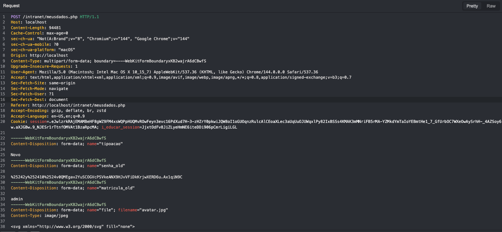
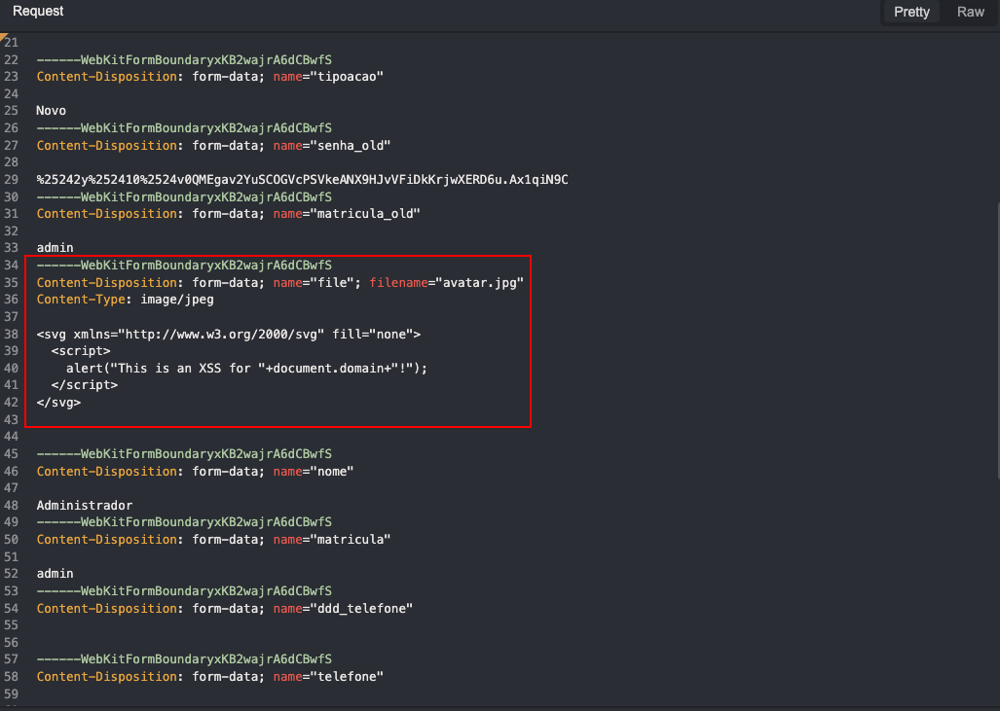
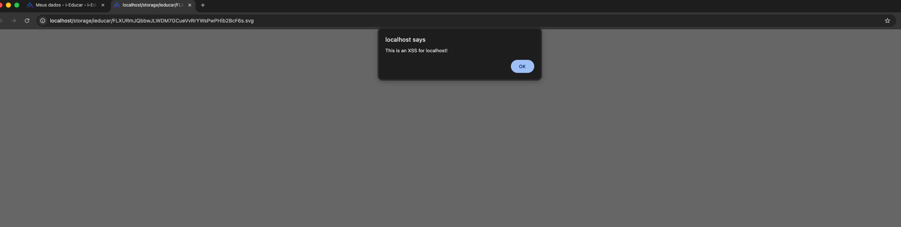

<div align="center">
  <a href="https://www.thoropass.com/" target="_blank" rel="noopener noreferrer">
    
  </a>
  <br><br>
  <a href="https://www.thoropass.com/talk-to-an-expert" target="_blank" rel="noopener noreferrer">
    
  </a>
  <a href="https://www.linkedin.com/company/thoropass/" target="_blank" rel="noopener noreferrer">
    
  </a>

  <h1>i-Educar: Stored XSS via Profile Picture Upload</h1>

  <p>🔐 <strong>Thoropass Vulnerability Research Program</strong> 🧪</p>
</div>

<div align="center">
<a href="https://www.cve.org/CVERecord?id=CVE-2026-2064" target="_blank" rel="noopener noreferrer"></a>
  
  
</div>


---

## Advisory Information

| &nbsp; | &nbsp; |
|:---|:---|
| **Researcher** | [Natan Morette](https://www.linkedin.com/in/nmmorette/) on behalf of [Thoropass](https://thoropass.com) |
| **Product** | [i-Educar](https://github.com/portabilis/i-educar) - Open-source, web-based school management system widely used by public education institutions in Brazil to manage academic and administrative data in real time. |
| **Affected Version** | 2.10.0 |
| **Endpoint** | `/intranet/meusdadod.php` |
| **Vulnerability Type** | CWE-79: Improper Neutralization of Input During Web Page Generation (Stored Cross-Site Scripting) |
| **CVE ID** | [CVE-2026-2064](https://www.cve.org/CVERecord?id=CVE-2026-2064) |

## Vulnerability Summary

The `/intranet/meusdadod.php` endpoint allows authenticated users to upload profile pictures (avatars) without proper file type validation or content sanitization. By exploiting the lack of server-side MIME type verification and file content inspection, an attacker can upload a malicious SVG file containing embedded JavaScript code disguised as a legitimate image file.

When any user accesses the uploaded file directly via its URL (e.g., when viewing a user profile or avatar), the browser interprets the SVG content and executes the embedded JavaScript in the victim's security context, resulting in **Stored Cross-Site Scripting (XSS)**.

## Technical Analysis

➤ Vulnerable Endpoint: `/intranet/meusdadod.php`

➤ Parameter: `file`

➤ Authentication: any authenticated user. The upload accepts an SVG (effectively HTML/JavaScript) because server-side MIME type verification and content inspection are missing.

### Proof of Concept

**➤ Step by Step:**

1. Navigate to the user data page: `/intranet/meusdadod.php`
2. Upload a new avatar photo and capture the request.
3. Insert the payload below in the file section.
4. The XSS is triggered when someone opens the user profile picture URL.

**➤ Payload:**

```html
<svg xmlns="http://www.w3.org/2000/svg" fill="none">
<script>
alert("This is an XSS for "+document.domain+"!");
</script>
</svg>
```

**➤ Screenshots:**







## Impact

This vulnerability falls under **A03:2021 - Injection** in the [OWASP Top 10](https://owasp.org/Top10/), specifically categorized as **Stored Cross-Site Scripting (XSS)**.

Potential impacts include:

- **Arbitrary JavaScript execution** in the context of the victim's browser.
- **Session hijacking** by stealing authentication cookies or tokens.
- **Account takeover** or unauthorized actions performed on behalf of the victim.
- **Phishing attacks** via injected fake login forms or malicious redirects.
- **Persistent exploitation**: since the payload is stored, any user who visits the page or resource will trigger the attack.
- **Reputation damage** and loss of user trust if attackers exploit this to deface content or steal data.

## Remediation

Validate uploaded avatars server-side by inspecting the real MIME type and file content, and reject SVG (or any non-raster) formats. Serve user-uploaded files from a sandboxed origin with a non-renderable `Content-Type` (e.g., `application/octet-stream`) and a `Content-Disposition: attachment` header so the browser never executes them inline.

## References

- [OWASP Cross-Site Scripting (XSS)](https://owasp.org/www-community/attacks/xss/)
- [OWASP Top 10 - A03:2021 Injection](https://owasp.org/Top10/A03_2021-Injection/)
- [CWE-79: Improper Neutralization of Input During Web Page Generation ('Cross-site Scripting')](https://cwe.mitre.org/data/definitions/79.html)
- [MDN Web Docs - XSS Prevention](https://developer.mozilla.org/en-US/docs/Web/Security/Types_of_attacks#cross-site_scripting_xss)

## ⚠️ Disclaimer

The vulnerability was identified through authorized security testing. The proof of concept is provided to help defenders validate their exposure and verify remediation.

Thoropass follows **coordinated vulnerability disclosure (CVD)** principles. Vulnerabilities are reported privately to maintainers, reasonable time is provided for remediation, and public advisories are released after coordination or fix availability.

## About Thoropass
Thoropass delivers enterprise-grade audits with AI-native speed and precision. Designed from day one to integrate auditors, automation, and infosec workflows in a single, closed-loop system, no add-ons, no handoffs.

Our experienced penetration testing team proactively discovers vulnerabilities in web applications, APIs, and infrastructure — helping organizations secure their systems before attackers find weaknesses.

<div align="center">
  <br>

  **Thoropass Vulnerability Research Program**

  <em>Improving ecosystem security through responsible research and disclosure.</em>

  <br><br>
  <a href="https://www.thoropass.com/platform/penetration-testing" target="_blank" rel="noopener noreferrer">
    
  </a>
  <br><br>
  <a href="https://www.thoropass.com/" target="_blank" rel="noopener noreferrer">
    
  </a>
  <a href="https://www.linkedin.com/company/thoropass/" target="_blank" rel="noopener noreferrer">
    
  </a>
</div>

---

<div align="center">
  <br><br>
  <a href="https://www.thoropass.com/talk-to-an-expert" target="_blank" rel="noopener noreferrer">
    
  </a>
</div>
