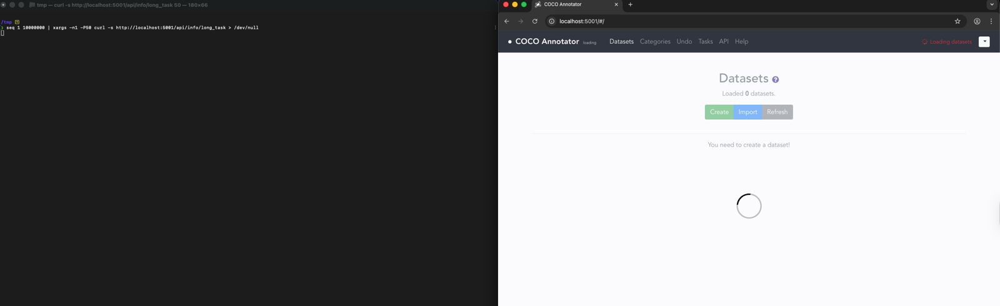

<div align="center">
  <a href="https://www.thoropass.com/" target="_blank" rel="noopener noreferrer">
    
  </a>
  <br><br>
  <a href="https://www.thoropass.com/talk-to-an-expert" target="_blank" rel="noopener noreferrer">
    
  </a>
  <a href="https://www.linkedin.com/company/thoropass/" target="_blank" rel="noopener noreferrer">
    
  </a>

  <h1>COCO Annotator: Unauthenticated Denial of Service via Task Queue Flood</h1>

  <p>🔐 <strong>Thoropass Vulnerability Research Program</strong> 🧪</p>
</div>

<div align="center">
<a href="https://www.cve.org/CVERecord?id=CVE-2026-2108" target="_blank" rel="noopener noreferrer"></a>
  
  
</div>


---

## Advisory Information

| &nbsp; | &nbsp; |
|:---|:---|
| **Researcher** | [Natan Morette](https://www.linkedin.com/in/nmmorette/) on behalf of [Thoropass](https://thoropass.com) |
| **Product** | [COCO Annotator](https://github.com/jsbroks/coco-annotator) - Open-source, web-based image annotation platform used to build datasets for computer vision and machine learning workflows, supporting the COCO dataset format. |
| **Affected Version** | 0.11.1 |
| **Endpoint** | `/api/info/long_task` |
| **Vulnerability Type** | CWE-306: Missing Authentication for Critical Function; CWE-400: Uncontrolled Resource Consumption |
| **CVE ID** | [CVE-2026-2108](https://www.cve.org/CVERecord?id=CVE-2026-2108) |

## Vulnerability Summary

The endpoint `/api/info/long_task` is exposed **without authentication or rate limiting**, and allows any remote user to enqueue Celery background tasks and write entries to the database (TaskModel) on every request.

This creates a **Denial of Service (DoS)** vulnerability. An attacker can flood the endpoint with repeated requests, overwhelming the Celery queue and workers, bloating the database, and rendering the entire application unresponsive, even after the attack stops.

## Technical Analysis

➤ Vulnerable Endpoint: `/api/info/long_task`

➤ Authentication: none required. The endpoint is missing both `@login_required` and any rate limiting, so any unauthenticated remote user can reach the task-enqueue sink.

### Vulnerable Code

```python
@api.route('/long_task')
class TaskTest(Resource):
    def get(self):
        task_model = TaskModel(group="test", name="Testing Celery")
        task_model.save()
        task = long_task.delay(20, task_model.id)
        return {'id': task.id, 'state': task.state}
```

Missing: `@login_required`, `@limiter.limit(...)`.

### Proof of Concept

**1. Run attack flood:**

```bash
seq 1 9999999 | xargs -n1 -P50 curl -s http://localhost:5001/api/info/long_task > /dev/null
```

**2. Observe symptoms:**

- Frontend (COCO Annotator) becomes unresponsive (“Loading datasets…” spinner indefinitely)
- HTTP requests slow down or fail:

```bash
curl -o /dev/null -s -w "Total: %{time_total}s\n" http://localhost:5001/api/info/long_task
```

- System logs show massive task creation and MongoDB inserts
- `redis-cli LLEN celery` shows queue depth growing uncontrollably

**3. Even after stopping the flood (CTRL+C), the system remains unusable.**

<p align="center">
  
  <br>
  <em>Evidence of the DoS attack</em>
</p>

## Impact

A remote unauthenticated attacker can:

- Enqueue thousands or millions of background tasks (`long_task.delay(...)`)
- Inflate the backend MongoDB with arbitrary TaskModel entries
- Exhaust all Celery workers and queue backlog (e.g., Redis/RabbitMQ)
- Cause **complete DoS**, blocking all frontend usage (e.g., dataset loading)
- Persist residual effects unless the task queue and DB are manually cleared

> Note: Even after stopping the attack, the system remains degraded due to the backlog of tasks being processed.

## Remediation

Require authentication on the endpoint (`@login_required`) and enforce rate limiting (`@limiter.limit(...)`) so unauthenticated clients cannot enqueue background tasks. Consider capping the number of in-flight tasks per user and bounding TaskModel growth.

## References

- [CWE-306: Missing Authentication for Critical Function](https://cwe.mitre.org/data/definitions/306.html)
- [CWE-400: Uncontrolled Resource Consumption](https://cwe.mitre.org/data/definitions/400.html)
- [OWASP Top 10 - A05:2021 Security Misconfiguration](https://owasp.org/Top10/A05_2021-Security_Misconfiguration/)

## ⚠️ Disclaimer

The vulnerability was identified through authorized security testing. The proof of concept is provided to help defenders validate their exposure and verify remediation.

Thoropass follows **coordinated vulnerability disclosure (CVD)** principles. Vulnerabilities are reported privately to maintainers, reasonable time is provided for remediation, and public advisories are released after coordination or fix availability.

## About Thoropass
Thoropass delivers enterprise-grade audits with AI-native speed and precision. Designed from day one to integrate auditors, automation, and infosec workflows in a single, closed-loop system, no add-ons, no handoffs.

Our experienced penetration testing team proactively discovers vulnerabilities in web applications, APIs, and infrastructure — helping organizations secure their systems before attackers find weaknesses.

<div align="center">
  <br>

  **Thoropass Vulnerability Research Program**

  <em>Improving ecosystem security through responsible research and disclosure.</em>

  <br><br>
  <a href="https://www.thoropass.com/platform/penetration-testing" target="_blank" rel="noopener noreferrer">
    
  </a>
  <br><br>
  <a href="https://www.thoropass.com/" target="_blank" rel="noopener noreferrer">
    
  </a>
  <a href="https://www.linkedin.com/company/thoropass/" target="_blank" rel="noopener noreferrer">
    
  </a>
</div>

---

<div align="center">
  <br><br>
  <a href="https://www.thoropass.com/talk-to-an-expert" target="_blank" rel="noopener noreferrer">
    
  </a>
</div>
