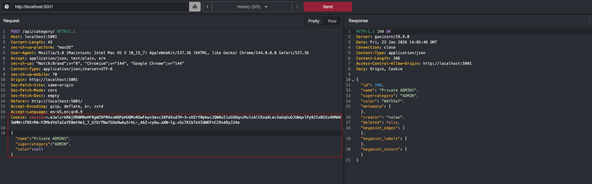

# BFLA COCO Annotator in DELETE /api/undo/

  
    
  
  
  
  <h1>Thoropass Vulnerability Research Program</h1>

<table>
 <tr>
    <td><strong>Author</strong></td>
    <td><a href="https://www.linkedin.com/in/nmmorette/">Natan Morette</a> on behalf of <a href="https://thoropass.com">Thoropass</a></td>
  </tr>
  <tr>
    <td><strong>Affected Application</strong></td>
    <td>
      <a href="https://github.com/jsbroks/coco-annotator">COCO Annotator</a> 
      <small>
        Open-source, web-based image annotation platform used to build datasets
        for computer vision and machine learning workflows, supporting the COCO
        dataset format.
      </small>
    </td>
  </tr>
  <tr>
    <td><strong>Affected Version</strong></td>
    <td>0.11.1</td>
  </tr>
  <tr>
    <td><strong>Endpoint</strong></td>
    <td><code>/api/undo/</code></td>
  </tr>
  <tr>
    <td><strong>Vulnerability Type</strong></td>
    <td>Broken Function Level Authorization</td>
  </tr>
</table>

## **Summary**

An attacker can delete categories created by other users via a DELETE request to the `/api/undo/` endpoint without any ownership or permission checks. This constitutes a **Broken Function Level Authorization (BFLA)** vulnerability, allowing unauthorized manipulation of protected resources.

## **Technical Details**

➤ Vulnerable Endpoint: `/api/undo/`

➤ Parameter: `?id=`

---

### **PoC (Proof of Concept)**

**1. Create a new category with a user with admin privileges:**

**2. Then, with another non-admin user send a request to delete the category; in this case, the admin created the category with ID 200.**

Request to view ID 200 category failed because users can only see their own category.

**3. Send a DELETE request to the endpoint `/api/undo`to delete the ID 200 category:**

**4. Note the application accepts the requests without validating that the user has permission to delete this category**

---

An attacker can exploit this vulnerability to delete all categories within the application.

    

  
   
  <em>Checking all categories before the attack</em>

    

  
   
  <em>Executing the attack to delete category IDs ranging from 1 to 200</em>

  
   
  <em>Checking the results returned a Status 200 with a success message. A normal user was able to delete all categories in the application</em>

  
   
  <em>Confirm that the application currently has no categories after the attack</em>

## **Impact**

- Any authenticated user can delete categories created by other users.
- No verification is done to ensure that the requester is the original creator or has elevated permissions (e.g., admin).
- Leads to **data integrity issues**, potential **denial of service**, or abuse in **multi-tenant environments**.

---

## **References**

- [OWASP API Security Top 10 – BFLA](https://owasp.org/API-Security/editions/2023/en/0xa5-broken-function-level-authorization/)
- CWE-285: Improper Authorization

---

## About Thoropass
Thoropass delivers enterprise-grade audits with AI-native speed and precision. Designed from day one to integrate auditors, automation, and infosec workflows in a single, closed-loop system — no add-ons, no handoffs.

  
  
    
  

