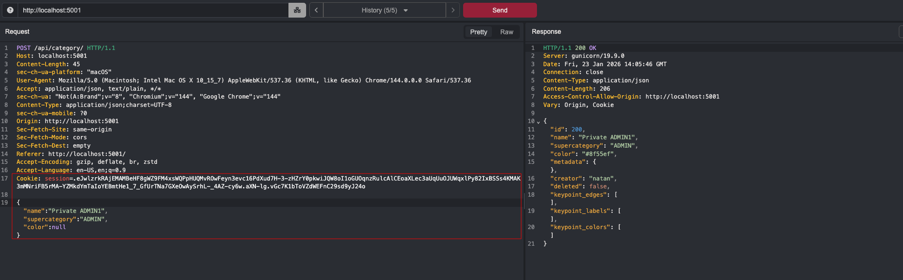

  
    
  
  

  <h1>COCO Annotator: Broken Function Level Authorization in Undo Endpoint</h1>

  
🔐 <strong>Thoropass Vulnerability Research Program</strong> 🧪

  
  

---

## Advisory Information

| &nbsp; | &nbsp; |
|:---|:---|
| **Researcher** | [Natan Morette](https://www.linkedin.com/in/nmmorette/) on behalf of [Thoropass](https://thoropass.com) |
| **Product** | [COCO Annotator](https://github.com/jsbroks/coco-annotator) - Open-source, web-based image annotation platform used to build datasets for computer vision and machine learning workflows, supporting the COCO dataset format. |
| **Affected Version** | 0.11.1 |
| **Endpoint** | `/api/undo/` |
| **Vulnerability Type** | CWE-285: Improper Authorization (Broken Function Level Authorization) |
| **CVE ID** | [CVE-2026-2109](https://www.cve.org/CVERecord?id=CVE-2026-2109) |

## Vulnerability Summary

An attacker can delete categories created by other users via a DELETE request to the `/api/undo/` endpoint without any ownership or permission checks. This constitutes a **Broken Function Level Authorization (BFLA)** vulnerability, allowing unauthorized manipulation of protected resources.

## Technical Analysis

➤ Vulnerable Endpoint: `/api/undo/`

➤ Parameter: `?id=`

➤ Authentication: any authenticated user. No ownership or role check is performed before the delete executes, so a non-admin user can delete categories owned by others.

### Proof of Concept

**1. Create a new category with a user with admin privileges:**

**2. Then, with another non-admin user, send a request to delete the category; in this case, the admin created the category with ID 200.**

Request to view the ID 200 category failed because users can only see their own category.

**3. Send a DELETE request to the endpoint `/api/undo` to delete the ID 200 category:**

**4. Note the application accepts the request without validating that the user has permission to delete this category.**

An attacker can exploit this vulnerability to delete all categories within the application.

  
   
  <em>Checking all categories before the attack</em>

  
   
  <em>Executing the attack to delete category IDs ranging from 1 to 200</em>

  
   
  <em>Checking the results returned a Status 200 with a success message. A normal user was able to delete all categories in the application</em>

  
   
  <em>Confirm that the application currently has no categories after the attack</em>

## Impact

- Any authenticated user can delete categories created by other users.
- No verification is done to ensure that the requester is the original creator or has elevated permissions (e.g., admin).
- Leads to **data integrity issues**, potential **denial of service**, or abuse in **multi-tenant environments**.

## Remediation

Enforce a server-side authorization check on the `/api/undo/` handler that ties the delete action to the authenticated user, verifying ownership of the target resource (or an explicit admin role) before the deletion executes.

## References

- [OWASP API Security Top 10 - BFLA](https://owasp.org/API-Security/editions/2023/en/0xa5-broken-function-level-authorization/)
- [CWE-285: Improper Authorization](https://cwe.mitre.org/data/definitions/285.html)

## ⚠️ Disclaimer

The vulnerability was identified through authorized security testing. The proof of concept is provided to help defenders validate their exposure and verify remediation.

Thoropass follows **coordinated vulnerability disclosure (CVD)** principles. Vulnerabilities are reported privately to maintainers, reasonable time is provided for remediation, and public advisories are released after coordination or fix availability.

## About Thoropass
Thoropass delivers enterprise-grade audits with AI-native speed and precision. Designed from day one to integrate auditors, automation, and infosec workflows in a single, closed-loop system, no add-ons, no handoffs.

Our experienced penetration testing team proactively discovers vulnerabilities in web applications, APIs, and infrastructure — helping organizations secure their systems before attackers find weaknesses.

   

  **Thoropass Vulnerability Research Program**

  <em>Improving ecosystem security through responsible research and disclosure.</em>

    
  
    
  
  

---

    
  

