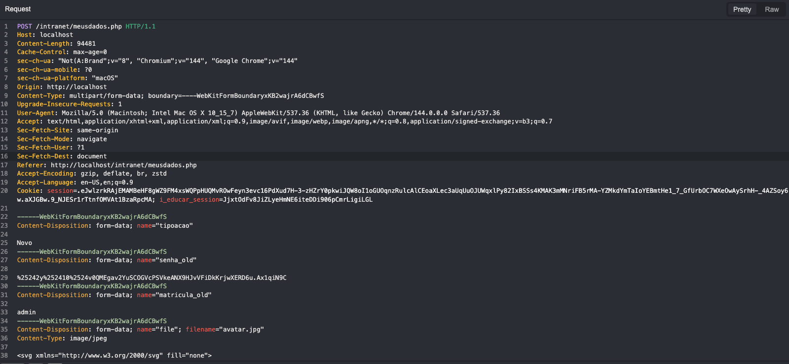

# Stored Cross-Site Scripting (XSS) via profile File Upload 

**📝 Summary**

An attacker can upload a malicious file containing embedded JavaScript that is executed when the file is accessed directly. This results in Stored Cross-Site Scripting (XSS). 

---

**🔎 Details**

➤ Vulnerable Endpoint: `/intranet/meusdadod.php`

➤ Parameter: `file`

---

**📚 PoC**

**➤ Step by Step:**

1. Navigate to the user data page: `/intranet/meusdadod.php`
2. Upload a new avatar foto and capture the request.
3. Insert the above payload in the file section
4. The XSS will be trigged when someone open the user profile picture URL.

**➤ Payload:**

```jsx
<svg xmlns="http://www.w3.org/2000/svg" fill="none">
<script>
alert("This is an XSS for "+document.domain+"!");
</script>
</svg>
```

**➤ Screenshots:**




---

**⚠️ Impact**

This vulnerability falls under **A03:2021 – Injection** in the [OWASP Top 10](https://owasp.org/Top10/), specifically categorized as **Stored Cross-Site Scripting (XSS)**.

Potential impacts include:

- **Arbitrary JavaScript execution** in the context of the victim’s browser.
- **Session hijacking** by stealing authentication cookies or tokens.
- **Account takeover** or unauthorized actions performed on behalf of the victim.
- **Phishing attacks** via injected fake login forms or malicious redirects.
- **Persistent exploitation**: since the payload is stored, any user who visits the page or resource will trigger the attack.
- **Reputation damage** and loss of user trust if attackers exploit this to deface content or steal data.

---

**🔗 References**

- [OWASP Cross-Site Scripting (XSS)](https://owasp.org/www-community/attacks/xss/)
- [OWASP Top 10 – A03:2021 Injection](https://owasp.org/Top10/A03_2021-Injection/)
- [CWE-79: Improper Neutralization of Input During Web Page Generation (‘Cross-site Scripting’)](https://cwe.mitre.org/data/definitions/79.html)
- [MDN Web Docs – XSS Prevention](https://developer.mozilla.org/en-US/docs/Web/Security/Types_of_attacks#cross-site_scripting_xss)

---

**🕵🏻‍♀️ Finder**

*Discovered by Natan Morette*

