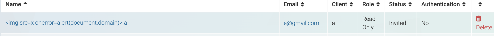
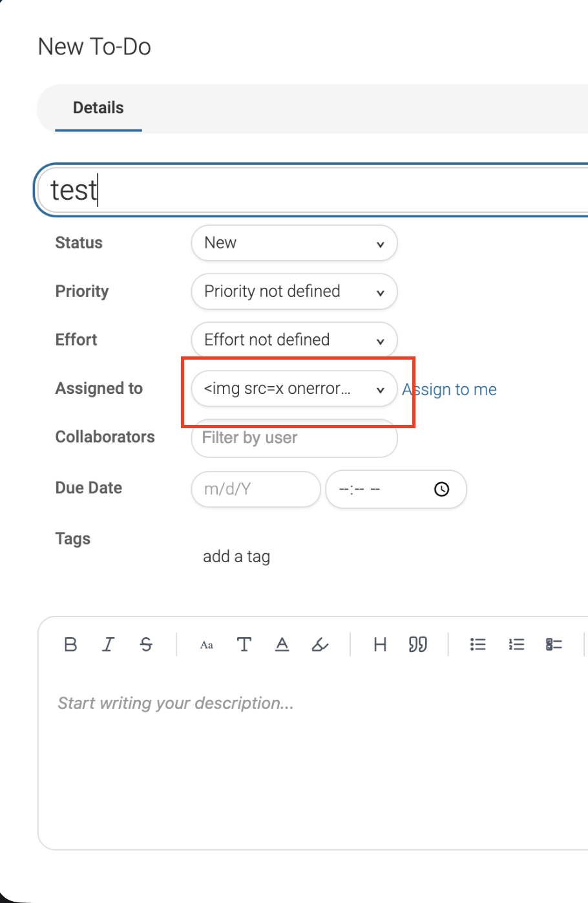
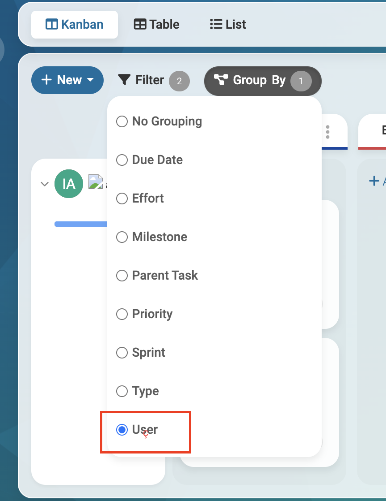
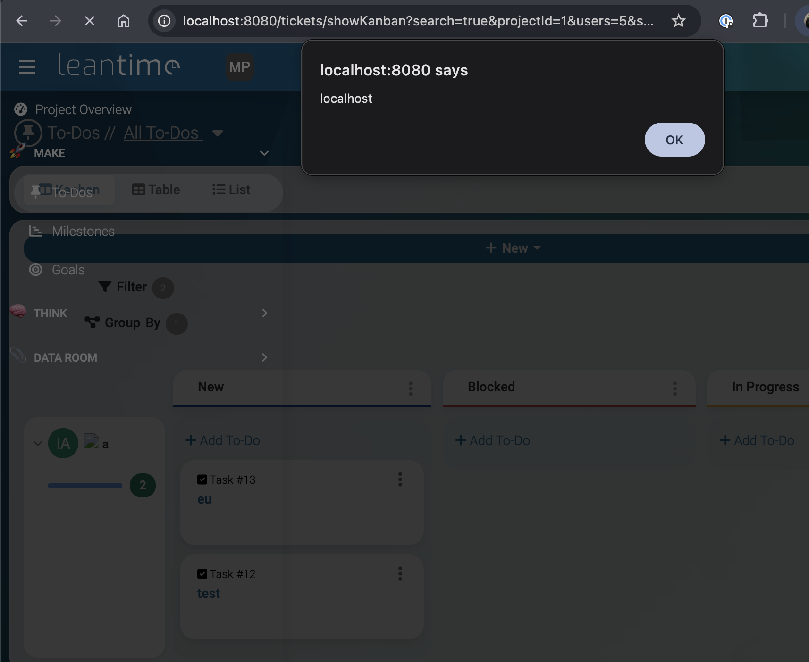
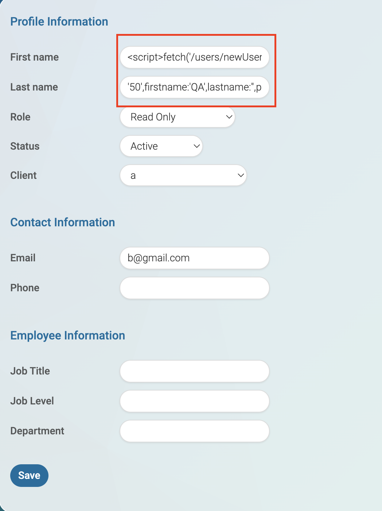
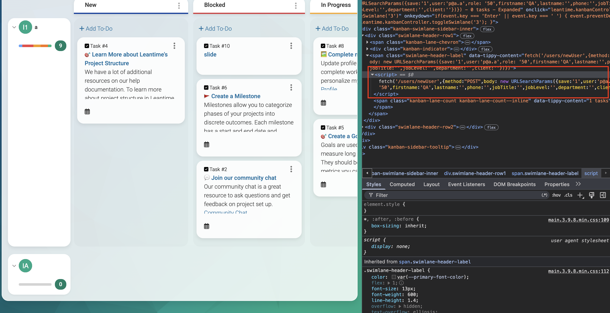
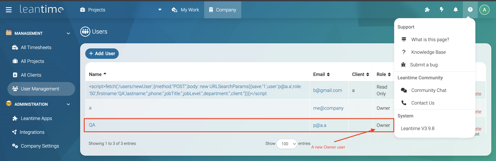

<div align="center">
  <a href="https://www.thoropass.com/" target="_blank" rel="noopener noreferrer">
    
  </a>
  <br><br>
  <a href="https://www.thoropass.com/talk-to-an-expert" target="_blank" rel="noopener noreferrer">
    
  </a>
  <a href="https://www.linkedin.com/company/thoropass/" target="_blank" rel="noopener noreferrer">
    
  </a>

  <h1>Leantime: Stored XSS in Kanban Swimlane Headers Enables Privilege Escalation to Owner</h1>

  <p>🔐 <strong>Thoropass Vulnerability Research Program</strong> 🧪</p>
</div>

<div align="center">
  
  
  
</div>


---

## Advisory Information

| &nbsp; | &nbsp; |
|:---|:---|
| **Researcher** | Alvin Ovando on behalf of [Thoropass](https://thoropass.com) |
| **Product** | [Leantime](https://github.com/Leantime/leantime) - Open-source, self-hosted project management system for goals, milestones, tickets, and Kanban boards, aimed at small teams and startups. |
| **Affected Version** | `<= 3.9.8` (and earlier sharing this template). |
| **Vulnerable Endpoint (Sink)** | `app/Views/Templates/components/kanban/swimlane-row-header.blade.php:108` - the Kanban swimlane header renders its `$label` with Blade's unescaped `{!! !!}` output, reached via `GET /tickets/showKanban` grouped by assignee. |
| **Source Endpoint** | `POST /users/editOwn` - stores the user's own `firstname` / `lastname` verbatim, which is later interpolated into the swimlane label. |
| **Escalation Endpoint** | `POST /users/newUser` - accepts a client-controlled `role` with no server-side ceiling and no CSRF token. |
| **Vulnerability Type** | CWE-79: Improper Neutralization of Input During Web Page Generation (Stored Cross-Site Scripting); CWE-268: Privilege Chaining. |
| **CVSS v3.1** | `8.7 (High)` - `CVSS:3.1/AV:N/AC:L/PR:L/UI:R/S:C/C:H/I:H/A:N` |
| **CVE ID** | Pending (CVE review in progress) |

## Vulnerability Summary

An authenticated stored cross-site scripting (XSS) vulnerability in the Kanban board's swimlane headers lets any low-privileged user inject JavaScript through their own profile name. The script executes in the browser session of any higher-privileged user (manager, owner, or admin) who views the board grouped by assignee.

An XSS chain to full privilege escalation is possible (a low-privileged user obtaining an owner/admin account).

## Technical Analysis

➤ **Sink:** the Kanban swimlane header renders its label without output encoding.

`app/Views/Templates/components/kanban/swimlane-row-header.blade.php:108`:

```php
{!! $label !!}
```

Blade's `{!! !!}` is unescaped output. Line `:54` only strips the leading avatar

```php
<div class="profileImage">…</div>
```

via `preg_replace`, leaving the rest of the label markup intact.

➤ **Source:** `$label` is assembled in `app/Domain/Tickets/Services/Tickets.php` and, for three grouping modes, is built from stored user input without `htmlspecialchars`. One being `:762` (group by assignee):

```php
$label = "<div class='profileImage'>...</div> ".$ticket['editorFirstname'].' '.$ticket['editorLastname'];
```

The sibling branches in the same block do encode: they call `htmlspecialchars((string) $ticket[...], ENT_QUOTES, 'UTF-8')`. This confirms the three branches above are missing the encoding.

The assignee branch (`:762`) interpolates the user's own `firstname` / `lastname`, which are stored verbatim (`app/Domain/Users/Repositories/Users.php:286`) with no sanitization.

➤ **Escalation:** reachable from `app/Domain/Users/Services/Users.php:1399` (`'role' => $post['role'] ?? ''`, no server-side ceiling; the only ceiling is the client-side dropdown at `app/Domain/Users/Templates/newUser.blade.php:30-31`), and CSRF is not enforced on the create path.

### Proof of Concept

**➤ Prerequisites:** any authenticated account (e.g. an editor), and being the assignee of at least one ticket in a project a higher-privileged user can view.

**➤ Step by Step:**

1. As the low-privileged user, edit your profile and set the first name to the payload below. It is stored raw via `POST /users/editOwn`; leave the last name empty (41 characters, within the `varchar(100)` limit):

```html

```



2. Ensure you are the assignee of a ticket in a shared project, so your name renders as a swimlane group header.



3. As a manager/owner/admin, open `http://[host]/tickets/showKanban` for that project and select **group by assignee**.



4. The `alert(document.domain)` fires in the privileged user's session, confirming stored, cross-user script execution.



**➤ Stored XSS to Privilege Escalation:**

In this case, the proof-of-concept payload must be split between the First Name and Last Name fields. The first portion of the payload goes into the First Name field, while the remaining portion goes into the Last Name field:

```
firstname: <script>fetch('/users/newUser',{method:"POST",body: new URLSearchParams({save:'1',user:'p@a.a',role:
lastname: '50',firstname:'QA',lastname:'',phone:'',jobTitle:'',jobLevel:'',department:'',client:''})})</script>
```

Because each field accepts a maximum of 100 characters, the combined payload must not exceed 200 characters in total. This limitation requires the payload to be divided across both fields so that it is reconstructed when the application processes the submitted values.



5. Do the same steps as the basic PoC (be a user with an assigned ticket, and group by user on the Kanban board). We can observe our payload loaded:



6. Now going to `/users/showAll` as an admin, we can observe a newly created Owner account:



## Impact

This vulnerability falls under **A03:2021 - Injection** in the [OWASP Top 10](https://owasp.org/Top10/), specifically categorized as **Stored Cross-Site Scripting (XSS)** chained to privilege escalation.

Stored, persistent XSS affecting all Leantime instances on the affected versions. Any authenticated user, regardless of role, can store a payload in a field they own (their name; equivalently a milestone headline or project name for the other two branches) that executes in the browser of every user who views the affected Kanban board grouped by assignee, milestone, or project.

Potential impacts include:

- **Arbitrary JavaScript execution** in the context of every higher-privileged user who views the affected Kanban board.
- **Privilege escalation**: because the user-creation path enforces no server-side role limit and no CSRF token, a low-privileged user can escalate to owner/admin.
- **Full application compromise**: account takeover, access to all projects and clients, and administrative control.
- **Persistent exploitation**: the payload is stored, so every subsequent view of the board re-fires the attack.
- **Action-in-session**: session cookies are httpOnly, so the primary risk is action-in-session (privilege escalation, data modification).

## Remediation

- HTML-encode the swimlane `$label` on output. Replace the unescaped `{!! $label !!}` directive at `swimlane-row-header.blade.php:108` with the escaped `{{ }}` form.
- Apply `htmlspecialchars((string) $value, ENT_QUOTES, 'UTF-8')` to the `editorFirstname` / `editorLastname` (and the milestone/project branches) when assembling `$label` at `Tickets.php:762`, matching the sibling branches that already encode.
- Sanitize `firstname` / `lastname` on the store path (`/users/editOwn`) rather than storing them verbatim.
- Enforce a server-side role ceiling on `POST /users/newUser` so a user cannot create an account with a role above their own.
- Re-enable global CSRF protection so state-changing requests require a valid token.

## References

- [OWASP Cross-Site Scripting (XSS)](https://owasp.org/www-community/attacks/xss/)
- [OWASP Top 10 - A03:2021 Injection](https://owasp.org/Top10/A03_2021-Injection/)
- [CWE-79: Improper Neutralization of Input During Web Page Generation ('Cross-site Scripting')](https://cwe.mitre.org/data/definitions/79.html)
- [CWE-268: Privilege Chaining](https://cwe.mitre.org/data/definitions/268.html)
- [MDN Web Docs - XSS Prevention](https://developer.mozilla.org/en-US/docs/Web/Security/Types_of_attacks#cross-site_scripting_xss)

## ⚠️ Disclaimer

The vulnerability was identified through authorized security testing. The proof of concept is provided to help defenders validate their exposure and verify remediation.

Thoropass follows **coordinated vulnerability disclosure (CVD)** principles. Vulnerabilities are reported privately to maintainers, reasonable time is provided for remediation, and public advisories are released after coordination or fix availability.

## About Thoropass
Thoropass delivers enterprise-grade audits with AI-native speed and precision. Designed from day one to integrate auditors, automation, and infosec workflows in a single, closed-loop system, no add-ons, no handoffs.

Our experienced penetration testing team proactively discovers vulnerabilities in web applications, APIs, and infrastructure — helping organizations secure their systems before attackers find weaknesses.

<div align="center">
  <br>

  **Thoropass Vulnerability Research Program**

  <em>Improving ecosystem security through responsible research and disclosure.</em>

  <br><br>
  <a href="https://www.thoropass.com/platform/penetration-testing" target="_blank" rel="noopener noreferrer">
    
  </a>
  <br><br>
  <a href="https://www.thoropass.com/" target="_blank" rel="noopener noreferrer">
    
  </a>
  <a href="https://www.linkedin.com/company/thoropass/" target="_blank" rel="noopener noreferrer">
    
  </a>
</div>

---

<div align="center">
  <br><br>
  <a href="https://www.thoropass.com/talk-to-an-expert" target="_blank" rel="noopener noreferrer">
    
  </a>
</div>
